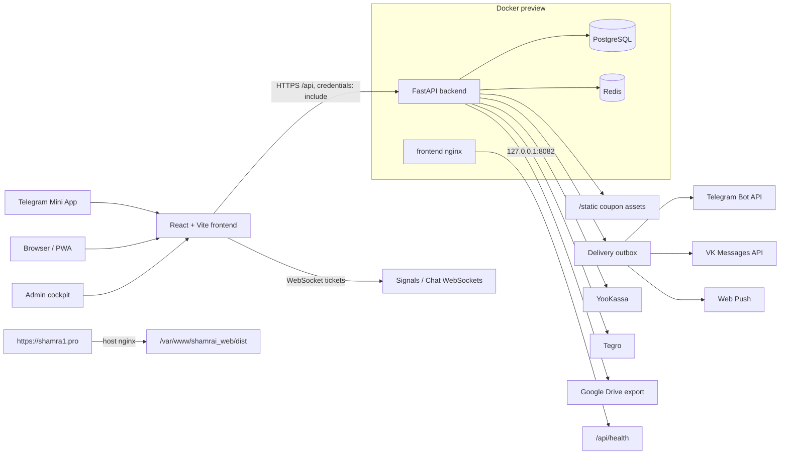

# Shamrai Mini App

Full-stack приложение для спортивной аналитики, прогнозов, подписок и клиентского сопровождения. Проект работает как Telegram Mini App, браузерная PWA-версия и админский cockpit для команды.

[GitHub repository](https://github.com/inftverezovsky/Mini-Web-Shamrai-)

## Что умеет проект

- Пользовательский кабинет: onboarding, профиль, тарифы, лента прогнозов, мои ставки, чат поддержки, уведомления и статистика.
- Админка: CRM, прогнозы, подписки, рассылки, web-chat, шаблоны сообщений, экспорт статистики и аудит действий.
- Авторизация: Telegram `initData`, VK ID OAuth, bot-session login, httpOnly cookie, роли `user`, `moderator`, `admin`, `owner`.
- Оплаты и доступы: Telegram Stars, YooKassa, Tegro, промокоды, абонементы на матчи и идемпотентная обработка webhook/update.
- Доставка сигналов: Telegram Bot API, VK Messages API, Web Push, WebSocket и retryable delivery outbox.
- Инфраструктура: FastAPI backend, React/Vite frontend, PostgreSQL, Redis hot cache, Alembic migrations, Docker Compose preview и host-nginx public deploy.

## Архитектура



Backend принимает API под `/api`, проверяет cookie/JWT, работает с PostgreSQL через SQLAlchemy async и отдаёт статические coupon-файлы. Внешняя доставка вынесена в outbox, чтобы Telegram, VK и Web Push можно было ретраить без двойной выдачи доступа.

Frontend собирается Vite. В production API вызывается same-origin через `/api`. Важно различать Docker preview и публичный сайт: здоровый контейнер `shamrai-frontend` на `8082` не означает, что `https://shamra1.pro/` обновился, потому что публичный домен обслуживается host nginx из `/var/www/shamrai_web/dist`.

## Стек

| Слой | Технологии |
| --- | --- |
| Backend | Python 3.11, FastAPI, SQLAlchemy async, Pydantic v2, Alembic, Uvicorn |
| Data | PostgreSQL, Redis, asyncpg, optional SQLite for tests/dev |
| Frontend | React 18, TypeScript, Vite, Tailwind CSS, React Query, Framer Motion, lucide-react |
| Integrations | Telegram Bot API, VK ID, VK Callback API, YooKassa, Tegro, Web Push, Google Drive export |
| Ops | Docker Compose, nginx, PowerShell deploy/repair scripts, GitHub Actions |

## Структура репозитория

```text
backend/
  src/
    api/          FastAPI routers: auth, users, bets, payments, admin, chat, webhooks
    core/         settings, security, roles, rate limits, Redis cache, message helpers
    models/       SQLAlchemy database/session and ORM models
    schemas/      Pydantic request/response contracts
    services/     payments, delivery, forecast, stats, chat, VK, Telegram
    scripts/      seed, reset, env patch, diagnostics
  alembic/        database migrations
  tests/          backend unittest suite

frontend/
  src/
    api/          request client, downloads, mock data, API errors
    components/   shared UI, auth screens, listeners, onboarding, notifications
    context/      AuthContext and LayoutModeContext
    features/     chat and performance modules
    pages/        user and admin screens
    utils/        Telegram, VK, Web Push, auth storage, analytics
  public/         brand, sport/bookmaker assets, manifest, service worker
  tests/          Vitest unit tests

deploy/nginx/     public nginx config examples
docs/             developer guide, process flows, VK delivery rules
scripts/          local verification and deploy/repair helpers
docker-compose.yml
.env.example
```

## Локальный запуск

### Docker Compose

```powershell
Copy-Item .env.example .env
Copy-Item backend\.env.example backend\.env
docker compose -p shamrai up -d --build
docker compose -p shamrai ps
curl http://127.0.0.1:8082/api/health
```

### Backend

```powershell
cd backend
py -3.11 -m venv .venv
.\.venv\Scripts\python.exe -m pip install -r requirements.txt
Copy-Item .env.example .env
.\.venv\Scripts\alembic.exe upgrade head
.\.venv\Scripts\python.exe -m src.scripts.seed_defaults --demo
.\.venv\Scripts\python.exe -m uvicorn src.main:app --reload --host 0.0.0.0 --port 8000
```

Для локальной browser/PWA разработки можно включить debug auth:

```env
DEBUG_MODE=true
ALLOW_DEBUG_AUTH_BYPASS=true
```

В production эти флаги должны быть `false`.

### Frontend

```powershell
cd frontend
npm install
Copy-Item .env.example .env
npm run dev
```

Если backend запущен отдельно на `8000`, используйте:

```env
VITE_API_URL=http://localhost:8000
VITE_ENABLE_DEBUG_AUTH=true
```

Для same-origin production build `VITE_API_URL` оставляют пустым.

## Переменные окружения

Реальные секреты нельзя коммитить, писать в README, shell history или чат. В репозитории хранятся только `.env.example` с безопасными placeholder-ами.

| Файл | Создать, если нет | Git ignored | Назначение |
| --- | --- | --- | --- |
| `.env` | да | да | Docker Compose, Postgres, preview port, frontend build args |
| `backend/.env` | да | да | backend runtime, JWT, Telegram/VK, payments, Google Drive |
| `frontend/.env` | да | да | локальный Vite config и публичные frontend build variables |

Ключевые production-переменные backend:

```env
APP_ENV=production
DEBUG_MODE=false
ALLOW_DEBUG_AUTH_BYPASS=false
DATABASE_URL=postgresql://<user>:<password>@<host>:5432/<database>
JWT_SECRET_KEY=<at-least-32-random-characters>
OWNER_TELEGRAM_ID=<telegram-owner-id>
TELEGRAM_BOT_TOKEN=<telegram-bot-token>
TELEGRAM_WEBHOOK_SECRET_TOKEN=<random-webhook-secret>
CORS_ALLOWED_ORIGINS=https://shamra1.pro,https://www.shamra1.pro
API_BASE_URL=https://shamra1.pro
FRONTEND_BASE_URL=https://shamra1.pro/app
YOOKASSA_SHOP_ID=<shop-id-or-empty>
YOOKASSA_SECRET_KEY=<secret-key-or-empty>
TEGRO_SHOP_ID=<shop-id-or-empty>
TEGRO_API_KEY=<api-key-or-empty>
TEGRO_SECRET_KEY=<secret-key-or-empty>
VK_GROUP_ID=<vk-group-id-or-empty>
VK_GROUP_ACCESS_TOKEN=<vk-group-access-token-or-empty>
VK_CALLBACK_CONFIRMATION_CODE=<vk-confirmation-code-or-empty>
VK_CALLBACK_SECRET=<vk-callback-secret-or-empty>
WEB_PUSH_VAPID_PUBLIC_KEY=<public-vapid-key-or-empty>
WEB_PUSH_VAPID_PRIVATE_KEY=<private-vapid-key-or-empty>
SECURITY_RATE_LIMIT_MODE=enforce
```

Backend intentionally fails fast in production if dangerous runtime combinations are detected: debug auth enabled, weak JWT secret, missing Telegram webhook secret, missing owner id, missing ruble payment provider or disabled rate-limit enforcement.

## Проверки

Полная локальная проверка:

```powershell
powershell -ExecutionPolicy Bypass -File .\scripts\verify-local.ps1
```

Backend:

```powershell
cd backend
.\.venv\Scripts\python.exe -m compileall -q src alembic
.\.venv\Scripts\alembic.exe heads
.\.venv\Scripts\python.exe -c "import src.main; print('backend_import_ok')"
.\.venv\Scripts\python.exe -m unittest discover -s tests -p "test_*.py"
```

Frontend:

```powershell
cd frontend
npm run lint
npm run build
npm test
npm run test:e2e
npm audit --audit-level=high
```

Docker and scripts:

```powershell
docker compose config --quiet
```

CI mirrors the same core gates in `.github/workflows/ci.yml`: backend tests/compile, frontend lint/unit tests/build, Playwright prelaunch smoke, Compose config validation and PowerShell script parsing.

## Deployment

Canonical Shamrai preview deployment:

| Field | Value |
| --- | --- |
| Server | `root@82.147.67.245` |
| App path | `/opt/shamrai-mini-app` |
| Docker Compose project | `shamrai` |
| Preview frontend port | `8082` |
| Health URL | `http://127.0.0.1:8082/api/health` |
| Public URL | `https://shamra1.pro/` |
| Public web root | `/var/www/shamrai_web/dist` |

Before any VDS deploy, repair or inspection, inventory Docker containers and listening ports. Keep one canonical preview only: do not solve conflicts by creating another app directory, compose project or frontend port.

Preview Docker deploy:

```bash
cp .env.example .env
cp backend/.env.example backend/.env
docker compose -p shamrai build
docker compose -p shamrai up -d
docker compose -p shamrai ps
curl http://127.0.0.1:8082/api/health
```

Guarded public frontend deploy helper:

```powershell
$env:SHAMRAI_SSH_PASSWORD = '<provide-at-runtime-do-not-store>'
powershell -ExecutionPolicy Bypass -File .\scripts\deploy-public-shamrai-web.ps1 -RepairShamraiConflicts
Remove-Item Env:\SHAMRAI_SSH_PASSWORD
```

Public deploy is complete only after `frontend/dist` is published to `/var/www/shamrai_web/dist` and `https://shamra1.pro/` references the newly built `assets/*.js` and `assets/*.css`.

Do not stop system nginx, unrelated containers, databases or ports `80/443` unless the task explicitly replaces the public production deployment and ownership is confirmed.

## Security and delivery invariants

- Never commit `.env`, private keys, tokens, passwords, database dumps or generated secret-bearing artifacts.
- Validate all external webhook payloads server-side.
- Activate paid access only after verified provider callback/update.
- Payment, forecast and delivery flows must be idempotent.
- Telegram webhook requires `X-Telegram-Bot-Api-Secret-Token`.
- VK `confirmation` returns plain text `VK_CALLBACK_CONFIRMATION_CODE` and does not require callback secret.
- VK non-confirmation events require strict `group_id` and `VK_CALLBACK_SECRET`.
- VK delivery is allowed only when `users.vk_user_id` exists and `users.vk_messages_allowed=true`.
- VK API calls bypass the global `HTTPS_PROXY`; Telegram may use a proxy separately.
- WebSocket streams use short-lived tickets instead of long-lived JWT in query strings.
- Production must keep `DEBUG_MODE=false`, `ALLOW_DEBUG_AUTH_BYPASS=false`, `SECURITY_RATE_LIMIT_MODE=enforce`.

## Local audit snapshot

Snapshot from local checkout on `2026-06-24`.

Production audit: `82/100`, launchable with caveats. No local ship blockers were found in the checked surface, but confidence is capped by missing live server health verification, missing Python dependency audit tooling and no browser E2E pass in this run.

Evidence checked:

- `git status --short --branch`: clean `main...origin/main` before README work.
- `git log --oneline --decorate -20`: recent history reviewed.
- `scripts/verify-local.ps1`: backend compile, Alembic head check, backend import, 303 backend tests, frontend lint and production build passed.
- `npm test`: 11 frontend test files, 35 tests passed.
- `npm audit --audit-level=high`: 0 frontend vulnerabilities found.
- `docker compose config --quiet`: Compose config is valid.
- PowerShell parser check for `scripts/*.ps1`: passed.
- Env surface reviewed by key names only; real `.env` values were not printed.

High-value follow-ups:

- Keep Playwright prelaunch smoke focused on non-payment launch paths: auth/session, profile setup, support chat and admin web-chat.
- Install/use a pinned Python dependency scanner such as `pip-audit` in CI.
- Add at least one Playwright smoke path for auth/session, feed, tariff/payment entry and admin login.
- Replace production daemon `print(...)` calls with structured logging before incident-heavy usage.
- Run a read-only VDS health audit before any public redeploy.

## Useful docs

- [docs/developer-guide.md](docs/developer-guide.md) - backend, frontend, database, payments, delivery and deployment map.
- [docs/process-flows.md](docs/process-flows.md) - Mermaid process diagrams for auth, payments, delivery, forecast, chat and deploy.
- [docs/vk-delivery.md](docs/vk-delivery.md) - required VK ID, Callback API and delivery rules.
- [docs/functional-algorithms.md](docs/functional-algorithms.md) - step-by-step functional algorithms.
- [docs/frontend-infra-optimization.md](docs/frontend-infra-optimization.md) - frontend performance and infra notes.
- [docs/backend-latency-optimization.md](docs/backend-latency-optimization.md) - backend latency and cache notes.

Recommended onboarding order for a new developer:

1. `README.md`
2. `docs/developer-guide.md`
3. `backend/src/models/models.py`
4. `backend/src/api/deps.py` and `backend/src/api/auth.py`
5. `backend/src/api/payments.py`
6. `backend/src/services/forecast_delivery.py`
7. `backend/src/services/delivery_outbox.py`
8. `frontend/src/App.tsx`
9. `frontend/src/context/AuthContext.tsx`
