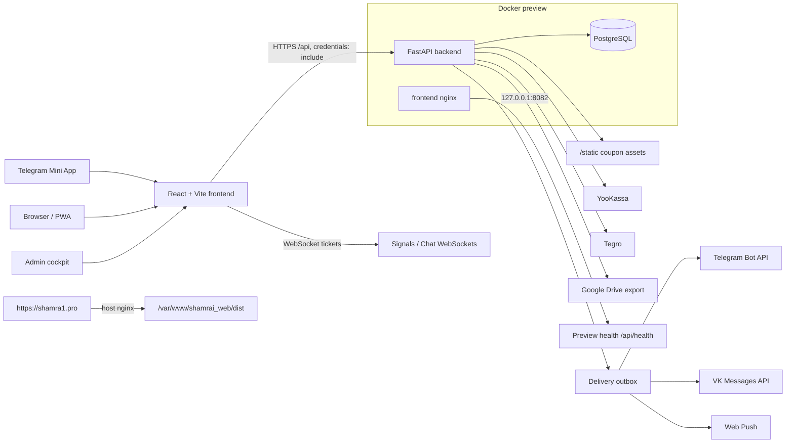
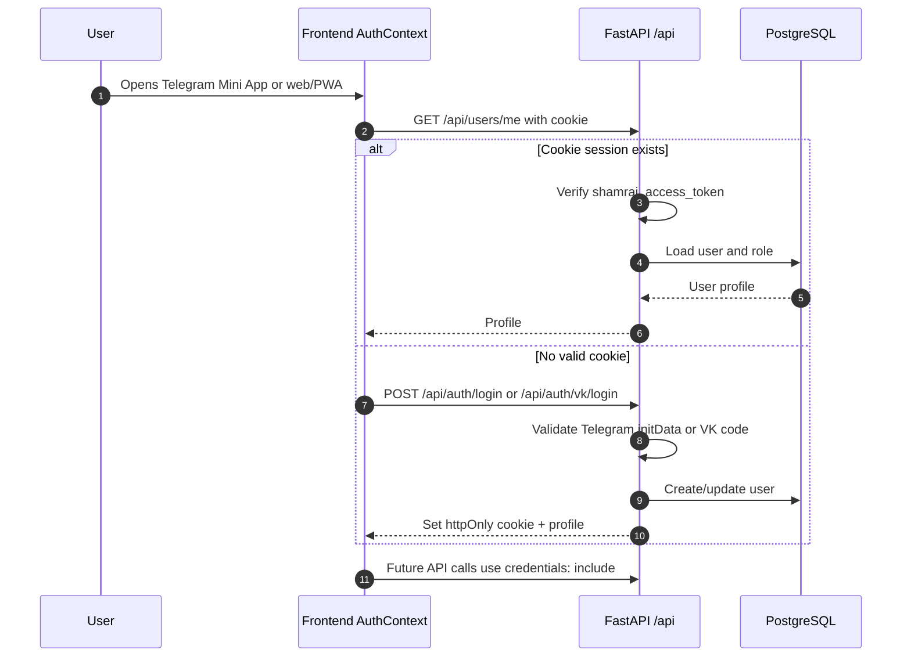
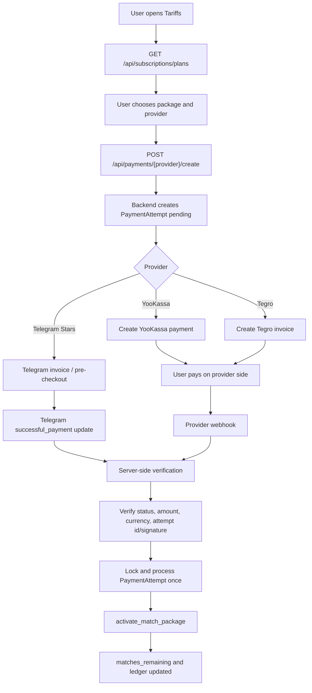
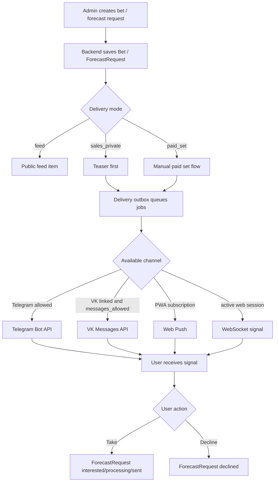
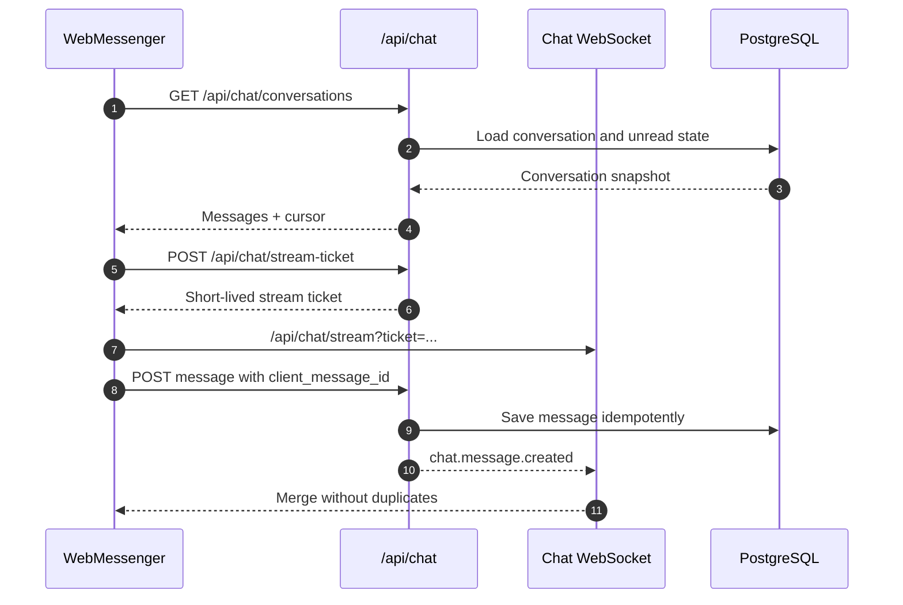
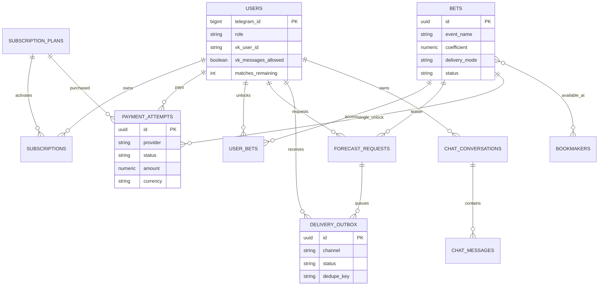
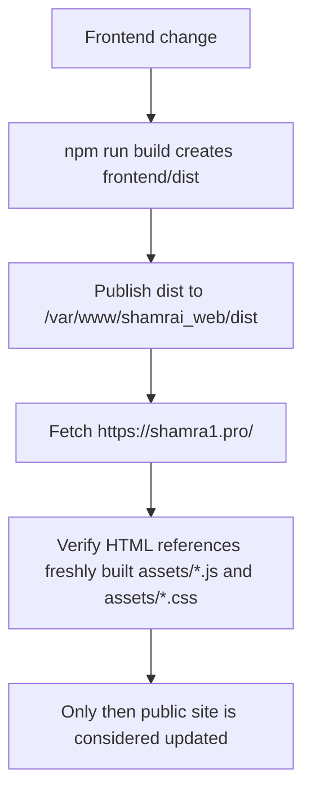

# Shamrai Mini App

Shamrai Mini App - full-stack приложение для спортивной аналитики, прогнозов и клиентского сопровождения. Оно работает как Telegram Mini App, браузерная web/PWA-версия и админский cockpit для команды.

Проект закрывает полный цикл: пользователь проходит вход и анкету, выбирает БК и интересующие виды спорта, покупает пакеты матчей, получает прогнозы и сигналы, общается в поддержке, а администратор управляет прогнозами, клиентами, рассылками, оплатами, статистикой и доставкой в Telegram/VK/Web Push.

GitHub-репозиторий: [inftverezovsky/Mini-Web-Shamrai-](https://github.com/inftverezovsky/Mini-Web-Shamrai-)

## Содержание

- [Что внутри](#что-внутри)
- [Архитектура](#архитектура)
- [Структура репозитория](#структура-репозитория)
- [Технологии](#технологии)
- [Основные сценарии](#основные-сценарии)
- [Локальный запуск](#локальный-запуск)
- [Переменные окружения](#переменные-окружения)
- [Миграции и seed](#миграции-и-seed)
- [API и домены](#api-и-домены)
- [Проверки](#проверки)
- [Docker и VDS-деплой](#docker-и-vds-деплой)
- [Безопасность](#безопасность)
- [Документация](#документация)

## Что внутри

Основные пользовательские поверхности:

- Telegram Mini App: вход через Telegram `initData`, работа внутри клиента Telegram.
- Browser/PWA: web-вход через VK ID, Telegram bot-session и debug-режим для локальной разработки.
- Пользовательский кабинет: лента прогнозов, чат, мои ставки, тарифы, профиль, onboarding.
- Админка: прогнозы, CRM, статистика, клиенты, рассылки, шаблоны, поддержка.
- Webhook-и: Telegram Bot API, VK Callback API, YooKassa, Tegro.
- Realtime: WebSocket-каналы для личных сигналов и web-чата.

Ключевые бизнес-домены:

| Домен | Что делает |
| --- | --- |
| Auth | Telegram/VK login, httpOnly cookie, роли и безопасный профиль |
| Users | анкета, БК, VK-связка, уведомления, баланс матчей |
| Bets | публичная лента, закрытые прогнозы, платные наборы, купоны |
| Payments | Telegram Stars, YooKassa, Tegro, промокоды, идемпотентные webhook-и |
| Match access | списание матчей из пакета, гарантии, ручная выдача, возвраты |
| Delivery | Telegram, VK, Web Push, WebSocket, retryable outbox |
| Admin | CRM, прогнозы, рассылки, статистика, аудит действий |
| Chat | клиентский web-чат, чат сотрудников, unread state, WebSocket updates |
| Stats | ROI, winrate, экспорт CSV/XLSX/Google Drive |

## Архитектура

Общая схема приложения:



Backend принимает все API-запросы под `/api`, проверяет cookie/JWT, работает с PostgreSQL через SQLAlchemy async и отдаёт статические coupon-файлы. Доставка во внешние каналы вынесена в outbox, чтобы Telegram, VK и Web Push можно было ретраить без двойной выдачи доступа.

Frontend собирается Vite, в production обслуживается nginx, а API по умолчанию вызывается same-origin через `/api`. В публичном домене `https://shamra1.pro/` важно различать Docker preview и host nginx static root: здоровый контейнер `shamrai-frontend` на `8082` сам по себе не означает, что публичный сайт обновился.

## Структура репозитория

```text
Mini-Web(Shamrai)/
  backend/
    src/
      api/          FastAPI routers: auth, users, bets, payments, admin, chat, webhooks
      core/         settings, security, roles, rate limits, templates, bookmaker helpers
      models/       SQLAlchemy Base, async session, ORM models
      schemas/      Pydantic request/response contracts
      services/     business logic: delivery, forecast, stats, chat, VK, Telegram
      scripts/      seed, reset, env patch, diagnostics
    alembic/        production-миграции
    tests/          backend unittest suite
    Dockerfile
    requirements.txt

  frontend/
    src/
      App.tsx       app shell, lazy pages, tab navigation
      api/          request client, downloads, mock data, errors
      components/   shared UI, auth screens, listeners, onboarding, notifications
      context/      AuthContext и LayoutModeContext
      features/     larger feature modules: chat, performance UI
      pages/        user/ и admin/ screens
      utils/        Telegram, VK, Web Push, auth storage, analytics
    public/         brand, sport and bookmaker assets, manifest, service worker
    Dockerfile
    package.json

  deploy/nginx/     nginx config for public host routing
  docs/             developer guide, process flows, VK delivery notes
  scripts/          local verification и deploy/repair scripts
  docker-compose.yml
  .env.example
```

## Технологии

Backend:

- Python, FastAPI `0.138.0`, Uvicorn.
- SQLAlchemy async `2.0.28`, PostgreSQL, asyncpg, Alembic.
- Pydantic v2 и pydantic-settings.
- PyJWT auth with httpOnly cookie.
- ReportLab, OpenPyXL и Google API client для reports/exports.
- Telegram/VK/payment integrations through local service modules.

Frontend:

- React 18, TypeScript, Vite.
- Tailwind CSS.
- React Query.
- Framer Motion.
- lucide-react icons.
- VK ID SDK и VK Bridge.
- PWA service worker и Web Push.

Runtime:

- `docker-compose.yml` runs `postgres`, `backend`, `frontend`.
- Backend container listens on `8000`.
- Frontend nginx container listens on `8080`.
- Canonical preview exposes `127.0.0.1:8082`.
- Public `https://shamra1.pro/` is served by host nginx from `/var/www/shamrai_web/dist`.

## Основные сценарии

### Auth



В production сессия живёт в httpOnly cookie `shamrai_access_token`. Frontend не должен хранить production JWT в `localStorage`; bearer token остаётся только для совместимости и локального debug.

### Оплата и доступ к матчам



Важный инвариант: доступ начисляется только после серверной проверки provider webhook/update. Повторный webhook не должен начислять пакет второй раз.

### Прогноз и доставка



VK delivery считается доступной только когда есть `users.vk_user_id` и `users.vk_messages_allowed=true`. VK ID linking сам по себе не значит, что сообщество может отправлять пользователю сообщения.

### Realtime chat



WebSocket URL получает короткий ticket, а не long-lived JWT в query string.

### Данные

Упрощённая модель данных:



## Локальный запуск

### Предварительно

Нужно установить:

- Python 3.11.
- Node.js + npm.
- PostgreSQL для полноценного backend-режима или Docker Desktop для compose.
- Git.

### Backend

```powershell
cd C:\Users\Sa1z1ngr0z\Desktop\Mini-Web(Shamrai)\backend
py -3.11 -m venv .venv
.\.venv\Scripts\python.exe -m pip install -r requirements.txt
Copy-Item .env.example .env
.\.venv\Scripts\alembic.exe upgrade head
.\.venv\Scripts\python.exe -m src.scripts.seed_defaults --demo
.\.venv\Scripts\python.exe -m uvicorn src.main:app --reload --host 0.0.0.0 --port 8000
```

По умолчанию backend читает настройки из `backend/.env`. Для локального браузерного smoke-теста можно включить debug auth:

```env
DEBUG_MODE=true
ALLOW_DEBUG_AUTH_BYPASS=true
```

Эти флаги должны быть `false` в production.

### Frontend

```powershell
cd C:\Users\Sa1z1ngr0z\Desktop\Mini-Web(Shamrai)\frontend
npm install
Copy-Item .env.example .env
npm run dev
```

Для локального Vite, если backend запущен отдельно на `8000`, укажите в `frontend/.env`:

```env
VITE_API_URL=http://localhost:8000
VITE_ENABLE_DEBUG_AUTH=true
```

Если frontend работает через production nginx/same-origin, `VITE_API_URL` оставляют пустым.

## Переменные окружения

Реальные секреты нельзя коммитить, писать в README, shell history или чат. В репозитории должны быть только `.env.example` с безопасными placeholder-ами.

Файлы с реальными значениями:

| Файл | Создать, если нет | Игнорируется git | Для чего |
| --- | --- | --- | --- |
| `C:\Users\Sa1z1ngr0z\Desktop\Mini-Web(Shamrai)\.env` | да | да | Docker Compose, Postgres, preview port, frontend build args |
| `C:\Users\Sa1z1ngr0z\Desktop\Mini-Web(Shamrai)\backend\.env` | да | да | Backend runtime, tokens, payments, VK, Google Drive |
| `C:\Users\Sa1z1ngr0z\Desktop\Mini-Web(Shamrai)\frontend\.env` | да | да | локальный Vite config и публичные frontend build variables |

Root `.env` для Docker Compose:

```env
POSTGRES_DB=shamrai
POSTGRES_USER=shamrai
POSTGRES_PASSWORD=<strong-postgres-password>
FRONTEND_PORT=8082
VITE_API_URL=
VITE_VK_ID_APP_ID=<vk-id-app-id-or-empty>
VITE_VK_ID_REDIRECT_URI=https://shamra1.pro
VITE_VK_GROUP_ID=<vk-group-id-or-empty>
VITE_TELEGRAM_BOT_USERNAME=Shamra1_bot
VITE_WEB_PUSH_VAPID_PUBLIC_KEY=<public-vapid-key-or-empty>
```

Минимальный backend `.env` для production:

```env
APP_ENV=production
DEBUG_MODE=false
ALLOW_DEBUG_AUTH_BYPASS=false
DATABASE_URL=postgresql://<user>:<password>@<host>:5432/<database>
JWT_SECRET_KEY=<at-least-32-random-characters>
OWNER_TELEGRAM_ID=<telegram-owner-id>
TELEGRAM_BOT_TOKEN=<telegram-bot-token>
TELEGRAM_WEBHOOK_SECRET_TOKEN=<random-webhook-secret>
CORS_ALLOWED_ORIGINS=https://shamra1.pro,https://www.shamra1.pro
API_BASE_URL=https://shamra1.pro
FRONTEND_BASE_URL=https://shamra1.pro/app
YOOKASSA_SHOP_ID=<shop-id-or-empty>
YOOKASSA_SECRET_KEY=<secret-key-or-empty>
YOOKASSA_RETURN_URL=https://shamra1.pro/app
TEGRO_SHOP_ID=<shop-id-or-empty>
TEGRO_API_KEY=<api-key-or-empty>
TEGRO_SECRET_KEY=<secret-key-or-empty>
TEGRO_RETURN_URL=https://shamra1.pro/app
VK_GROUP_ID=<vk-group-id-or-empty>
VK_GROUP_ACCESS_TOKEN=<vk-group-access-token-or-empty>
VK_CALLBACK_CONFIRMATION_CODE=<vk-confirmation-code-or-empty>
VK_CALLBACK_SECRET=<vk-callback-secret-or-empty>
WEB_PUSH_VAPID_PUBLIC_KEY=<public-vapid-key-or-empty>
WEB_PUSH_VAPID_PRIVATE_KEY=<private-vapid-key-or-empty>
GOOGLE_SERVICE_ACCOUNT_JSON_B64=<base64-service-account-json-or-empty>
SECURITY_RATE_LIMIT_MODE=enforce
```

Frontend `.env` for local development:

```env
VITE_API_URL=http://localhost:8000
VITE_ENABLE_DEBUG_AUTH=true
VITE_VK_ID_APP_ID=<vk-id-app-id-or-empty>
VITE_VK_ID_REDIRECT_URI=https://shamra1.pro
VITE_VK_GROUP_ID=<vk-group-id-or-empty>
VITE_TELEGRAM_BOT_USERNAME=Shamra1_bot
VITE_WEB_PUSH_VAPID_PUBLIC_KEY=<public-vapid-key-or-empty>
```

Production backend не стартует, если:

- `APP_ENV=production` и `DEBUG_MODE=true`;
- нет реального `TELEGRAM_BOT_TOKEN`;
- не указан `OWNER_TELEGRAM_ID`;
- `JWT_SECRET_KEY` короче 32 символов или равен dev-secret;
- пустой `TELEGRAM_WEBHOOK_SECRET_TOKEN`;
- не настроен ни один рублёвый провайдер оплаты: YooKassa или Tegro;
- `SECURITY_RATE_LIMIT_MODE` не равен `enforce`;
- включён VK, но нет callback/delivery secret values.

## Миграции и seed

Production schema управляется Alembic:

```powershell
cd C:\Users\Sa1z1ngr0z\Desktop\Mini-Web(Shamrai)\backend
.\.venv\Scripts\alembic.exe upgrade head
```

Стандартные справочники:

```powershell
cd C:\Users\Sa1z1ngr0z\Desktop\Mini-Web(Shamrai)\backend
.\.venv\Scripts\python.exe -m src.scripts.seed_defaults
```

Демо-данные только для local/dev:

```powershell
.\.venv\Scripts\python.exe -m src.scripts.seed_defaults --demo
```

В Docker backend выполняет `alembic upgrade head` перед запуском API.

## API и домены

Все routers подключены под `/api`.

| Route group | Файл | Назначение |
| --- | --- | --- |
| `/api/auth/*` | `backend/src/api/auth.py` | Telegram/VK login, bot-session login, cookie session, profile merge |
| `/api/users/*`, `/api/bookmakers` | `backend/src/api/users.py` | профиль, onboarding, preferences, VK delivery state, history |
| `/api/bets/*` | `backend/src/api/bets.py` | feed, take bet, hints, admin create/update/resolve, notes |
| `/api/subscriptions/*` | `backend/src/api/subscriptions.py` | package plans, debug buy, manual assignment, invite links |
| `/api/payments/*` | `backend/src/api/payments.py` | Telegram Stars, YooKassa, Tegro, promo validation, webhooks |
| `/api/signals/*` | `backend/src/api/signals.py` | personal signals, web push, WebSocket stream |
| `/api/chat/*` | `backend/src/api/chat.py` | native support-chat клиента и сотрудников, WebSocket stream |
| `/api/admin/*` | `backend/src/api/admin.py` | dashboard, CRM, stats, users, templates, exports, audit |
| `/api/admin/*` | `backend/src/api/admin_broadcast.py` | announcements, forecast broadcasts, paid sets, forecast requests |
| `/api/admin/web-chat/*` | `backend/src/api/admin_web_chat.py` | older admin support-chat stream |
| `/api/marketing/*` | `backend/src/api/marketing.py` | pulse, daily spin, swipe, quiz, PvP, marathon |
| `/api/crowd-bets/*` | `backend/src/api/crowd_bets.py` | active crowd bet and funding |
| `/api/telegram/webhook` | `backend/src/api/telegram_webhook.py` | bot commands, callback buttons, Stars payment updates |
| `/api/vk/callback` | `backend/src/api/vk_callback.py` | VK confirmation, message permissions, forecast buttons |
| `/api/stats/*` | `backend/src/api/stats.py` | global stats and bookmaker logo export |
| `/api/go/*` | `backend/src/api/go.py` | safe bookmaker redirects |
| `/api/health` | `backend/src/main.py` | preview/API health |

### Роли

| Роль | Доступ |
| --- | --- |
| `user` | клиентский кабинет, прогнозы, оплата, чат, профиль |
| `moderator` | доступ сотрудника к части админских сценариев |
| `admin` | CRM, прогнозы, рассылки, статистика, управление клиентами |
| `owner` | полный доступ, включая owner-only операции |

Backend dependencies для доступа находятся в `backend/src/api/deps.py`.

## Проверки

Полная локальная проверка:

```powershell
cd C:\Users\Sa1z1ngr0z\Desktop\Mini-Web(Shamrai)
powershell -ExecutionPolicy Bypass -File .\scripts\verify-local.ps1
```

Backend checks:

```powershell
cd C:\Users\Sa1z1ngr0z\Desktop\Mini-Web(Shamrai)\backend
.\.venv\Scripts\python.exe -m compileall -q src alembic
.\.venv\Scripts\alembic.exe heads
.\.venv\Scripts\python.exe -c "import src.main; print('backend_import_ok')"
.\.venv\Scripts\python.exe -m unittest discover -s tests -p 'test_*.py'
```

Frontend checks:

```powershell
cd C:\Users\Sa1z1ngr0z\Desktop\Mini-Web(Shamrai)\frontend
npm run lint
npm run build
```

Docker smoke:

```bash
docker compose -p shamrai up -d --build
docker compose -p shamrai ps
curl http://127.0.0.1:8082/api/health
```

## Docker и VDS-деплой

Canonical Shamrai preview deployment:

| Field | Value |
| --- | --- |
| Server | `root@82.147.67.245` |
| App path | `/opt/shamrai-mini-app` |
| Docker Compose project | `shamrai` |
| Preview frontend port | `8082` |
| Health URL | `http://127.0.0.1:8082/api/health` |
| Public URL | `https://shamra1.pro/` |
| Public web root | `/var/www/shamrai_web/dist` |

Перед любым VDS deploy/repair/inspect нужно сначала инвентаризировать Docker containers и listening ports. Нельзя решать конфликт созданием другого app directory, другого compose project или другого frontend port.

Preview deploy with Docker:

```bash
cp .env.example .env
cp backend/.env.example backend/.env
nano .env
nano backend/.env
docker compose -p shamrai build
docker compose -p shamrai up -d
docker compose -p shamrai ps
curl http://127.0.0.1:8082/api/health
```

Logs:

```bash
docker compose -p shamrai logs -f backend
docker compose -p shamrai logs -f frontend
```

Codex/PowerShell guarded public deploy helper:

```powershell
$env:SHAMRAI_SSH_PASSWORD = '<provide-at-runtime-do-not-store>'
powershell -ExecutionPolicy Bypass -File .\scripts\deploy-public-shamrai-web.ps1 -RepairShamraiConflicts
Remove-Item Env:\SHAMRAI_SSH_PASSWORD
```

Public frontend deployment rule:



Не останавливайте system nginx, unrelated containers, databases или ports `80/443`, если задача явно не заменяет public production deployment и принадлежность цели не подтверждена.

## Безопасность

Hard rules:

- Никогда не коммитьте `.env`, private keys, tokens, passwords, database dumps или сгенерированные файлы с секретами.
- Используйте placeholder-ы в docs и `.env.example`.
- Не логируйте provider secrets, Telegram tokens, VK tokens, callback secrets, JWT secrets или database URLs.
- Валидируйте все внешние webhook payloads на сервере.
- Платный доступ активируется только после verified provider callback/update.
- Повторные provider callbacks должны быть идемпотентными.
- Telegram webhook требует `X-Telegram-Bot-Api-Secret-Token`.
- VK `confirmation` возвращает plain text confirmation code и не требует callback secret.
- VK non-confirmation events требуют строгие `group_id` и `VK_CALLBACK_SECRET`.
- VK API calls намеренно обходят global `HTTPS_PROXY`; Telegram может использовать proxy отдельно.
- Production должен держать `DEBUG_MODE=false`, `ALLOW_DEBUG_AUTH_BYPASS=false`, `SECURITY_RATE_LIMIT_MODE=enforce`.

## Частые проблемы

| Симптом | Что проверить |
| --- | --- |
| `shamrai-frontend` healthy, но `https://shamra1.pro/` не изменился | public site берёт файлы из `/var/www/shamrai_web/dist`, нужно опубликовать новый `frontend/dist` |
| VK dashboard пишет "Сервер вернул неправильный ответ" | `/api/vk/callback` на `confirmation` должен вернуть plain text `VK_CALLBACK_CONFIRMATION_CODE` |
| VK delivery не работает у связанного пользователя | `vk_user_id` не равен permission; проверьте `vk_messages_allowed=true` |
| Payment webhook пришёл, доступа нет | проверить `PaymentAttempt`, сумму, валюту, provider id/signature и idempotency guard |
| WebSocket не подключается | сначала получить stream ticket через `/api/signals/stream-ticket` или `/api/chat/stream-ticket` |
| Local browser login не работает | для dev включить `DEBUG_MODE=true`, `ALLOW_DEBUG_AUTH_BYPASS=true`, `VITE_ENABLE_DEBUG_AUTH=true` |
| Production backend не стартует | проверить runtime hard stops в `backend/src/core/config.py` |

## Документация

- [docs/developer-guide.md](docs/developer-guide.md) - подробная карта backend, frontend, БД, платежей, доставки, деплоя.
- [docs/process-flows.md](docs/process-flows.md) - отдельные Mermaid-схемы auth, payments, delivery, forecast, chat, deploy.
- [docs/vk-delivery.md](docs/vk-delivery.md) - обязательные правила для VK ID, Callback API и доставки.
- [docs/functional-algorithms.md](docs/functional-algorithms.md) - пошаговые функциональные алгоритмы.

Рекомендуемый порядок чтения для нового разработчика:

1. `README.md`.
2. `docs/developer-guide.md`.
3. `backend/src/models/models.py`.
4. `backend/src/api/deps.py` и `backend/src/api/auth.py`.
5. `backend/src/api/payments.py`.
6. `backend/src/services/match_access.py`.
7. `backend/src/services/forecast_delivery.py`.
8. `backend/src/services/delivery_outbox.py`.
9. `frontend/src/App.tsx`.
10. `frontend/src/context/AuthContext.tsx`.
