# Админское обучение Shamrai

Материал для администраторов Shamrai: где нажимать, как работают публикации, рассылки, заявки, результаты, статистика, CRM, чаты и настройки.

Открываемая HTML-версия: [index.html](index.html).

## Быстрый маршрут администратора

1. **Панель -> Лента** - добавить открытый прогноз или текстовую публикацию в клиентскую Ленту.
2. **Панель -> Рассылки -> Прогноз** - отправить клиентам анонс закрытого прогноза.
3. **Панель -> Рассылки -> Набор** - отправить платный набор и собрать заявки на ручную продажу.
4. **Панель -> Заявки** - обработать клиентов, которые нажали **Взять**, отправить полную ставку или закрыть вручную.
5. **Панель -> Результаты** - проставить победу, неудачу или возврат, отправить уведомление о падении коэффициента.
6. **Статистика** - посмотреть результаты Shamrai, автора, ленты, закрытых прогнозов, наборов и клиентов.
7. **Клиенты** - найти клиента, изменить группу, метку, баланс матчей и БК.
8. **Чаты** - ответить клиентам от имени Shamrai.
9. **Настройки** - управлять текстами, глобальными режимами, интеграциями, визуалом, мониторингом и маркетингом.
10. **Кабинет клиента** - временно посмотреть интерфейс глазами клиента; кнопка **Открыть админку** возвращает назад.

## Правила безопасности

- Не вставляйте Telegram, VK, YooKassa, Tegro, JWT, базу данных, proxy и любые другие секреты в чат, документы или скриншоты.
- Вкладка **Интеграции** специально закрыта паролем. Открывайте её только когда нужно проверить или изменить внешний сервис.
- Перед массовой рассылкой проверяйте выбранные БК, спорт, коэффициент и текст. Ошибка в таргетинге уйдёт сразу нескольким клиентам.
- Перед удалением клиента, прогноза или сбросом сессий убедитесь, что действие действительно нужно.
- Для публичного сайта здоровый контейнер сам по себе не доказывает, что публичный домен обновился; это правило относится к деплою, не к работе админки.

## Навигация и вход в админку

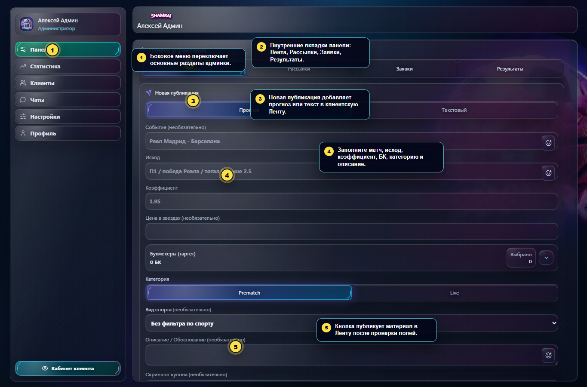

Что важно:

- Слева находится основное меню администратора: **Панель**, **Статистика**, **Клиенты**, **Чаты**, **Настройки**, **Профиль**.
- В разделе **Панель** есть внутренние вкладки: **Лента**, **Рассылки**, **Заявки**, **Результаты**.
- Кнопка **Кабинет клиента** внизу бокового меню переключает администратора в клиентский просмотр.
- Если вы случайно ушли в клиентский просмотр, нажмите **Открыть админку**.

## Публикация в Ленту

Путь: **Панель -> Лента**.


Как опубликовать прогноз:

1. Открыть **Панель**.
2. Выбрать внутреннюю вкладку **Лента**.
3. Оставить режим **Прогноз**.
4. Заполнить **Событие**, если нужно: например, `Реал Мадрид - Барселона`.
5. Заполнить **Исход**: например, `П1`, `ТБ 2.5`, `победа Реала`.
6. Указать **Коэффициент**. Это обязательное поле для прогноза.
7. При необходимости указать **Цена в звездах**.
8. Выбрать **Букмекеры (таргет)**. Если выбраны БК, прогноз показывается клиентам, у которых есть хотя бы одна из этих БК.
9. Если нужно, добавить ссылки для кнопок БК.
10. Выбрать категорию **Prematch** или **Live**.
11. Указать **Вид спорта** и **Описание / Обоснование**.
12. При необходимости приложить **Скриншот купона**.
13. Нажать **Опубликовать прогноз в Ленту**.

Как опубликовать текст:

1. В блоке **Новая публикация** переключиться с **Прогноз** на **Текстовый**.
2. Указать **Заголовок**, если нужен.
3. Заполнить **Текст публикации**.
4. При необходимости приложить изображение.
5. Нажать **Опубликовать текст в Ленту**.

## Рассылка закрытого прогноза

Путь: **Панель -> Рассылки -> Прогноз**.

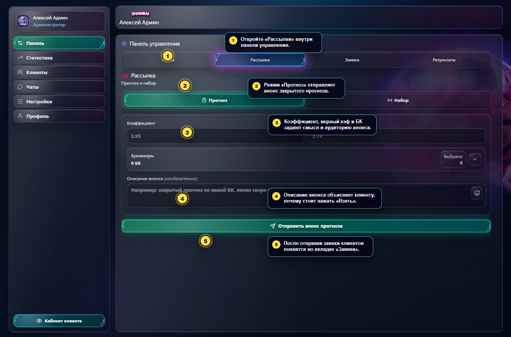

Как работает:

- Администратор отправляет клиентам короткий анонс закрытого прогноза.
- Клиент видит анонс и выбирает **Взять** или **Не взять**.
- Клиенты, которые нажали **Взять**, появляются в **Панель -> Заявки**.
- Полная ставка отправляется позже из очереди заявок или автоматически, если включена автоотправка у подготовленного прогноза.

Что заполнить:

1. Открыть **Панель -> Рассылки**.
2. Выбрать режим **Прогноз**.
3. Указать **Коэффициент**.
4. При необходимости указать **Верный** коэффициент.
5. Выбрать **Букмекеры**. Это главный фильтр аудитории.
6. Добавить **Описание анонса**: коротко объяснить, почему клиенту стоит взять прогноз.
7. Нажать **Отправить анонс прогноза**.

Важно: если БК выбраны неверно, анонс уйдёт не той аудитории. Перед отправкой проверьте список БК и текст.

## Рассылка набора

Путь: **Панель -> Рассылки -> Набор**.

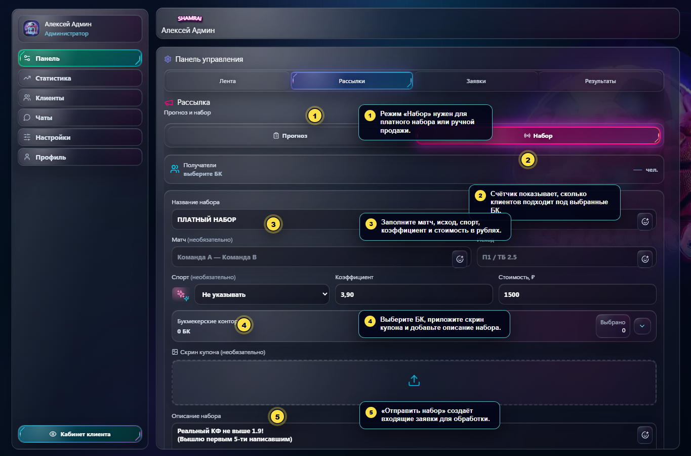

Набор используется для платной подборки или ручной продажи через диалог.

Как отправить набор:

1. Открыть **Панель -> Рассылки**.
2. Переключиться на **Набор**.
3. Проверить блок **Получатели**. Он показывает, сколько клиентов подходит под выбранные БК.
4. Заполнить **Название набора**.
5. Указать **Матч**, **Исход**, **Спорт**, **Коэффициент** и **Стоимость, ₽**.
6. Выбрать **Букмекерские конторы**.
7. Приложить **Скрин купона**, если он нужен для продажи.
8. Добавить **Описание набора**.
9. Нажать **Отправить набор**.

После отправки заявки по набору обрабатываются в **Панель -> Заявки**. Для набора обычно важна ручная коммуникация: открыть диалог, договориться с клиентом, отметить продажу.

## Очередь заявок

Путь: **Панель -> Заявки**.

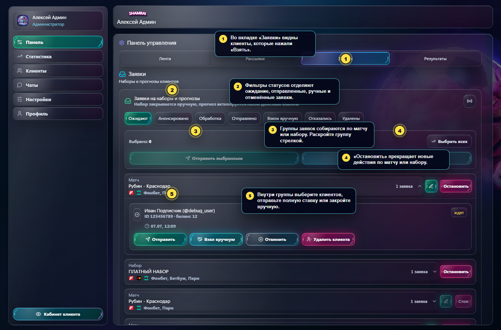

Что видно:

- Фильтры статусов: **Ожидают**, **Анонсировано**, **Обработка**, **Отправлено**, **Взяли вручную**, **Отказались**, **Удалены**.
- Заявки сгруппированы по матчу или набору.
- Внутри группы виден клиент, баланс, время, канал доставки и текущий статус.
- Кнопка **Остановить** прекращает новые действия по матчу или набору.

Как обработать одного клиента:

1. Открыть **Панель -> Заявки**.
2. Выбрать нужный статус, чаще всего **Ожидают**.
3. Раскрыть группу матча стрелкой.
4. Найти клиента.
5. Нажать **Отправить**, если полная ставка уже подготовлена.
6. Нажать **Полная ставка**, если нужно заполнить детали прогноза перед отправкой.
7. Нажать **Взял вручную**, если продажа или выдача прошла вне автоматической доставки.
8. Нажать **Отменить**, если клиент отказался или заявку не нужно продолжать.
9. Нажать **Удалить клиента**, если его нужно убрать из этой очереди.

Как обработать несколько клиентов:

1. В статусе **Ожидают** выбрать клиентов галочками.
2. Нажать **Отправить выбранным**, чтобы отправить полную ставку выбранным клиентам.
3. Нажать **Закрыть вручную**, если заявки обработаны вручную.

Если у клиента 0 матчей, отправка может быть заблокирована до оплаты. В таком случае используйте диалог, оплату или ручной сценарий по правилам продаж.

## Результаты матчей

Путь: **Панель -> Результаты**.

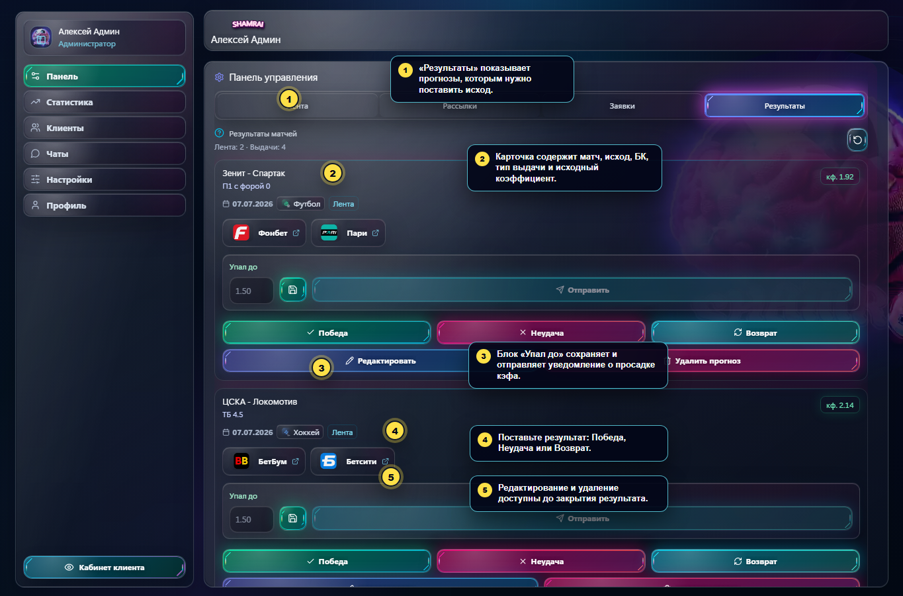

Что делать после завершения матча:

1. Открыть **Панель -> Результаты**.
2. Найти матч.
3. Проверить событие, исход, БК, тип выдачи и коэффициент.
4. Если коэффициент просел, заполнить **Упал до**.
5. Нажать иконку сохранения, чтобы сохранить значение падения.
6. Нажать **Отправить**, чтобы уведомить клиентов о падении коэффициента.
7. После окончания матча выбрать результат: **Победа**, **Неудача** или **Возврат**.

Дополнительные действия:

- **Редактировать** - изменить матч, исход, коэффициент, спорт, БК или ссылки БК.
- **Удалить прогноз** - убрать прогноз из очереди результатов. Используйте осторожно.

## Статистика

Путь: **Статистика**.

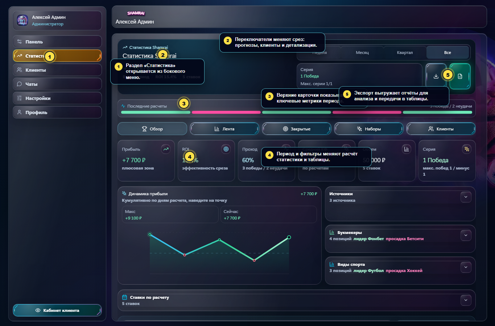

Как читать раздел:

- Верхний блок показывает прибыль, ROI, количество ставок, серию и выбранный период.
- Переключатель периода меняет расчёт: **Неделя**, **Месяц**, **Квартал**, **Все**.
- Внутренние срезы: **Обзор**, **Лента**, **Закрытые**, **Наборы**, **Клиенты**.
- Карточки показывают прибыль, ROI, проход, средний КФ, объём и серию.
- График показывает динамику прибыли.
- Блоки **Источники**, **Букмекеры**, **Виды спорта** помогают понять, где результат сильнее или слабее.
- Кнопки экспорта выгружают отчёты в файлы или внешние таблицы, если интеграция настроена.

Типовой сценарий:

1. Открыть **Статистика**.
2. Выбрать период.
3. Выбрать срез: общий, лента, закрытые, наборы или клиенты.
4. Проверить ROI, проход и средний КФ.
5. Открыть детализацию по БК и спорту.
6. При необходимости выгрузить отчёт.

## CRM клиентов

Путь: **Клиенты**.

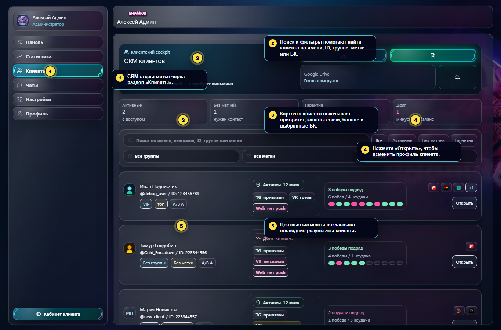

Что видно в списке:

- Поиск по имени, username, ID, группе и метке.
- Фильтры по активности, группе, метке и БК.
- Приоритет клиента: активен, гарантия, долг, нужен контакт и другие состояния.
- Каналы связи: Telegram, VK, Web Push.
- Баланс матчей и выбранные БК.
- Последние результаты клиента цветными сегментами.

Как найти клиента:

1. Открыть **Клиенты**.
2. Ввести имя, username или ID в поиск.
3. При необходимости выбрать группу, метку или БК.
4. Нажать **Открыть** в строке клиента.

## Карточка клиента

Путь: **Клиенты -> Открыть**.

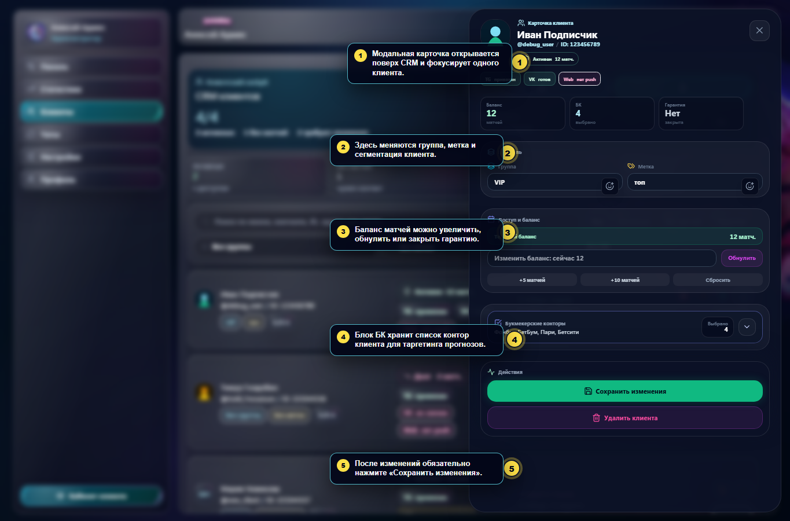

Что можно изменить:

- **Группа** - сегмент клиента, например `VIP`, `новые`, `риск`.
- **Метка** - короткая пометка, например `топ`, `важный`, `долг`.
- **Баланс матчей** - добавить или обнулить доступные матчи.
- **Гарантия** - закрыть активную гарантию победой, если такой сценарий применим.
- **Букмекерские конторы** - выбрать БК клиента для дальнейшего таргетинга.

Как сохранить изменения:

1. Открыть карточку клиента.
2. Изменить нужные поля.
3. Проверить баланс и БК.
4. Нажать **Сохранить изменения**.

Опасные действия:

- **Обнулить** меняет доступ клиента к матчам.
- **Удалить клиента** доступно только привилегированным ролям и удаляет клиента из системы. Перед нажатием проверьте ID и имя.

## Чаты

Путь: **Чаты**.

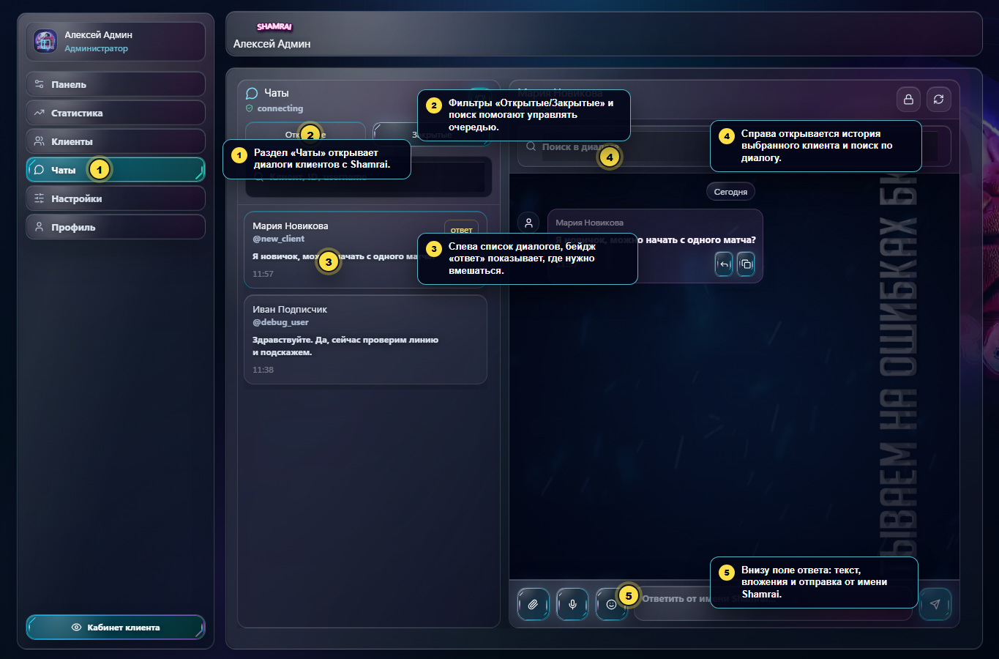

Что есть в разделе:

- Список диалогов клиентов.
- Фильтры **Открытые** и **Закрытые**.
- Поиск по клиенту, ID и username.
- Бейдж **ответ** показывает, где клиент ждёт реакции.
- История выбранного диалога.
- Поиск внутри диалога.
- Поле ответа от имени Shamrai.
- Иконки для вложений и отправки.
- Кнопка закрытия или повторного открытия диалога в правом верхнем углу истории.

Как ответить клиенту:

1. Открыть **Чаты**.
2. Выбрать **Открытые**.
3. Найти диалог в списке или через поиск.
4. Нажать на диалог.
5. Прочитать историю.
6. Написать ответ в нижнем поле.
7. При необходимости приложить файл или изображение.
8. Нажать кнопку отправки.

Если вопрос закрыт, нажмите иконку замка, чтобы закрыть диалог. Если клиент вернулся или разговор нужно продолжить, диалог можно переоткрыть.

## Тексты сообщений

Путь: **Настройки -> Тексты сообщений**.

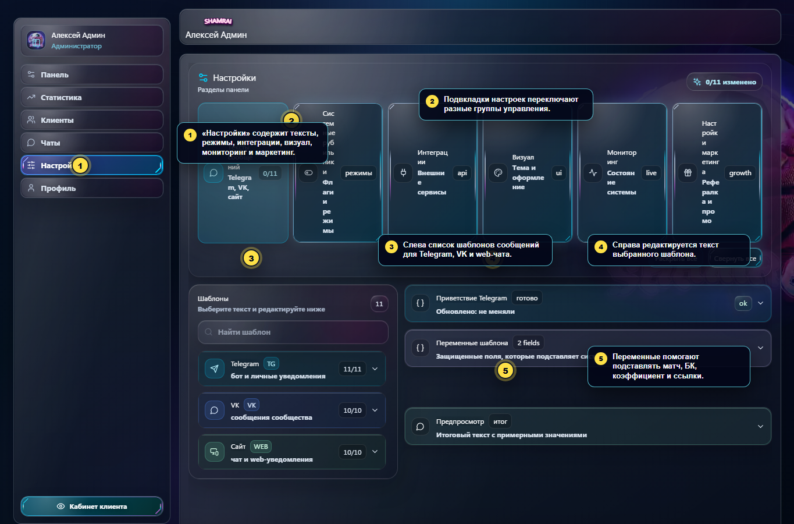

Раздел нужен для редактирования шаблонов Telegram, VK и web-чата.

Как изменить шаблон:

1. Открыть **Настройки**.
2. Выбрать **Тексты сообщений**.
3. Слева выбрать группу: **Telegram**, **VK** или **Сайт**.
4. Выбрать конкретный шаблон.
5. Справа отредактировать текст.
6. Использовать переменные шаблона, если нужно подставить матч, БК, коэффициент, ссылку или другой параметр.
7. Проверить предпросмотр.
8. Сохранить изменения.

Правило: не удаляйте переменные, если они нужны шаблону. Например, если шаблон должен показать коэффициент или ссылку, переменная должна остаться в тексте.

## Системные рубильники

Путь: **Настройки -> Системные рубильники**.

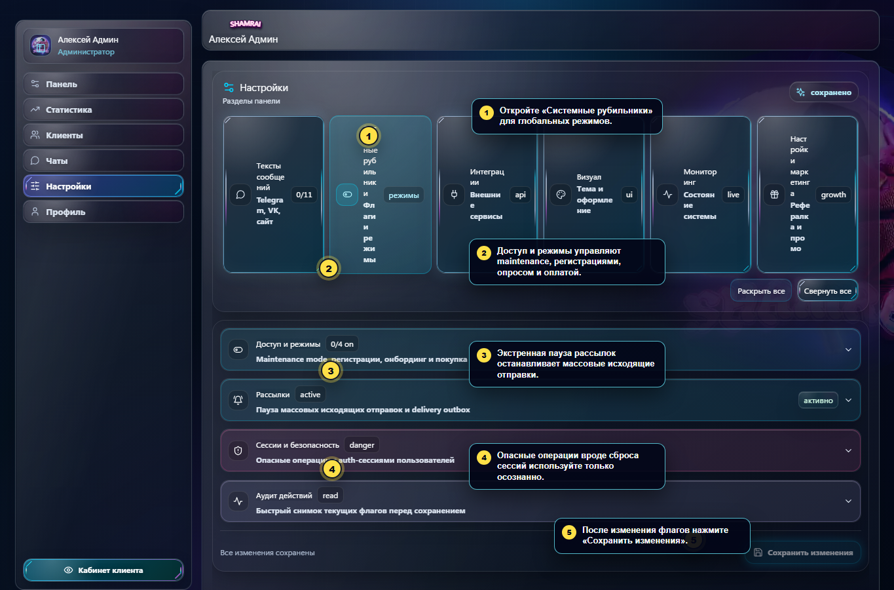

Что здесь находится:

- **Режим обслуживания** - ограничивает пользовательские сценарии.
- **Запрет регистраций** - закрывает вход новых пользователей.
- **Приветственный опрос** - управляет подробной анкетой клиента.
- **Покупка абонементов** - включает или выключает покупки.
- **Экстренная пауза рассылок** - останавливает массовые исходящие отправки и delivery outbox.
- **Сбросить все сессии пользователей** - опасное действие, после него пользователям потребуется войти заново.
- **Аудит действий** - быстрый снимок текущих флагов перед сохранением.

Как применять:

1. Открыть нужный блок.
2. Изменить флаг.
3. Проверить, что изменение действительно нужно.
4. Нажать **Сохранить изменения**.

Для экстренной паузы рассылок используйте этот раздел, если нужно быстро остановить массовую доставку без остановки всего приложения.

## Интеграции

Путь: **Настройки -> Интеграции**.

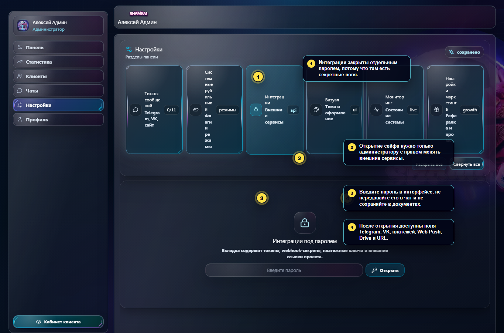

Раздел закрыт паролем, потому что внутри находятся настройки внешних сервисов:

- Telegram bot и webhook.
- VK, VK ID и callback.
- YooKassa, Tegro и платёжные возвраты.
- Web Push VAPID.
- Google Drive экспорт.
- Публичные URL, ссылки поддержки и proxy.

Как работать безопасно:

1. Открывать вкладку только когда нужно проверить или изменить интеграцию.
2. Вводить пароль только в интерфейсе админки.
3. Не отправлять пароль, токены и ключи в чат.
4. После открытия использовать **Проверить** для read-only диагностики, если она доступна.
5. Сохранять изменения только после проверки конкретного поля.

## Визуал, мониторинг и маркетинг

Эти разделы находятся в **Настройки**.

**Визуал**:

- Цвета темы.
- Logo URL и Background URL.
- Glass opacity, blur, radius, font scale и glow.
- Готовые пресеты темы.
- Глобальный performance mode.

**Мониторинг**:

- Онлайн пользователей.
- Статус парсера.
- Последние логи.
- Диагностический отчёт.
- Используйте как read-only проверку, если задача только посмотреть состояние.

**Настройки маркетинга**:

- Реферальная программа.
- Авто-скидка пригласившему.
- Бонус матчами.
- Промо-виджеты.
- Risk queue и события наград.

После изменений в этих разделах также нажимайте **Сохранить изменения**.

## FAQ для администратора

**Где создать прогноз в открытую Ленту?**  
**Панель -> Лента -> Прогноз -> Опубликовать прогноз в Ленту**.

**Где отправить закрытый анонс, чтобы клиент нажал "Взять"?**  
**Панель -> Рассылки -> Прогноз -> Отправить анонс прогноза**.

**Где увидеть клиентов, которые нажали "Взять"?**  
**Панель -> Заявки**, чаще всего фильтр **Ожидают**.

**Где отправить полную ставку?**  
В **Панель -> Заявки** раскрыть матч и нажать **Отправить** или **Полная ставка**.

**Где поставить результат матча?**  
**Панель -> Результаты**, затем выбрать **Победа**, **Неудача** или **Возврат**.

**Где изменить баланс матчей клиенту?**  
**Клиенты -> Открыть -> Доступ и баланс -> Сохранить изменения**.

**Где ответить клиенту?**  
**Чаты -> Открытые -> выбрать диалог -> написать ответ -> отправить**.

**Где поменять текст Telegram/VK/web-сообщения?**  
**Настройки -> Тексты сообщений**.

**Где быстро остановить массовые рассылки?**  
**Настройки -> Системные рубильники -> Экстренная пауза рассылок -> Сохранить изменения**.

**Где находятся токены и внешние сервисы?**  
**Настройки -> Интеграции**. Не передавайте секреты в чат и не сохраняйте их в документах.

## Обновление скриншотов

Для обновления скриншотов запустить локальный frontend в debug/mock-режиме:

```powershell
cd C:\Users\Sa1z1ngr0z\Desktop\Mini-Web(Shamrai)\frontend
$env:VITE_ENABLE_DEBUG_AUTH = 'true'
npm run dev -- --host 127.0.0.1 --port 5177
```

В другом терминале:

```powershell
cd C:\Users\Sa1z1ngr0z\Desktop\Mini-Web(Shamrai)
node .\scripts\capture-admin-training-screenshots.mjs
```

Скрипт сохраняет финальные изображения в `docs/admin-training/assets/`.
