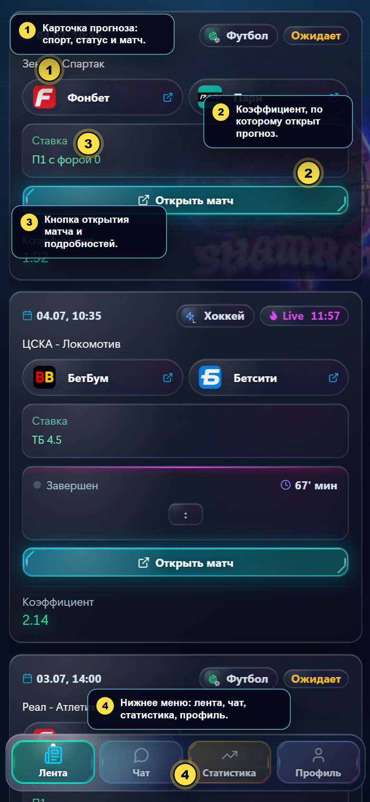
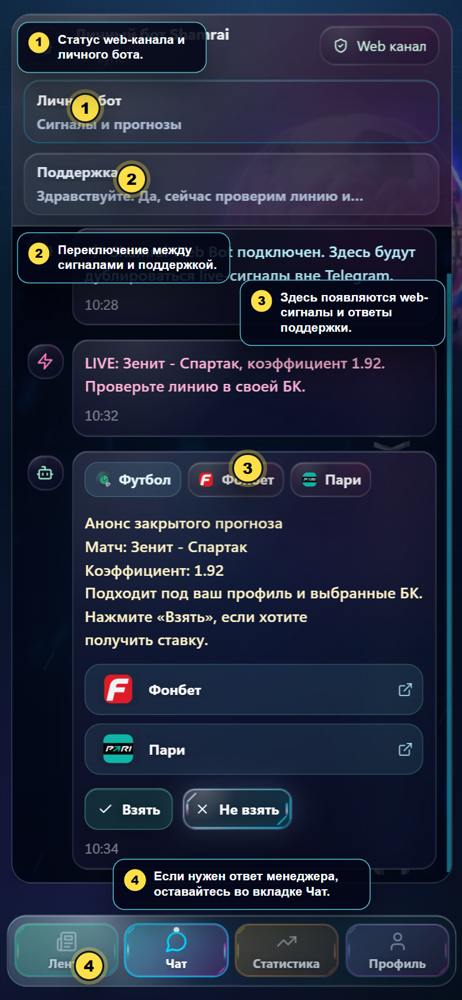
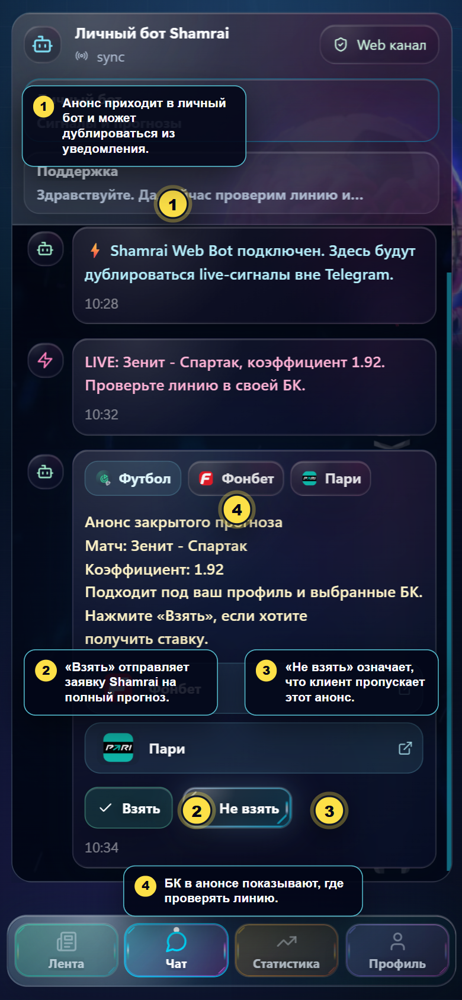
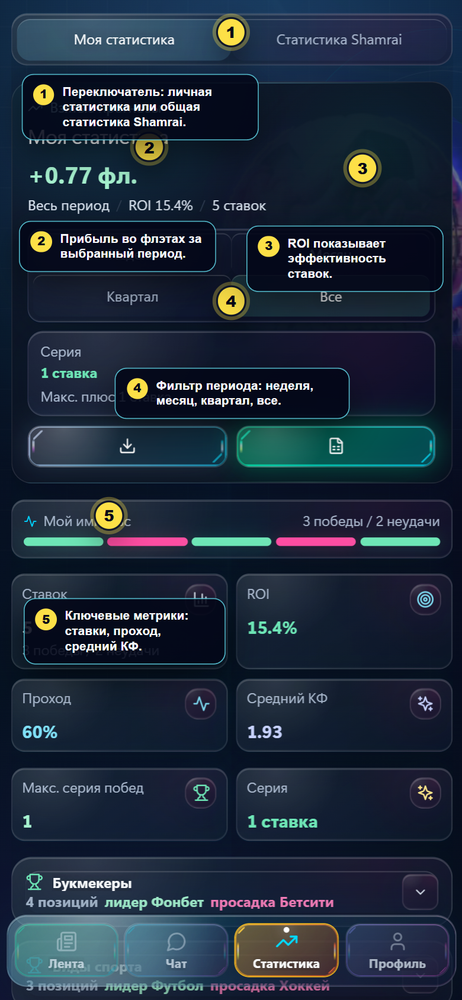
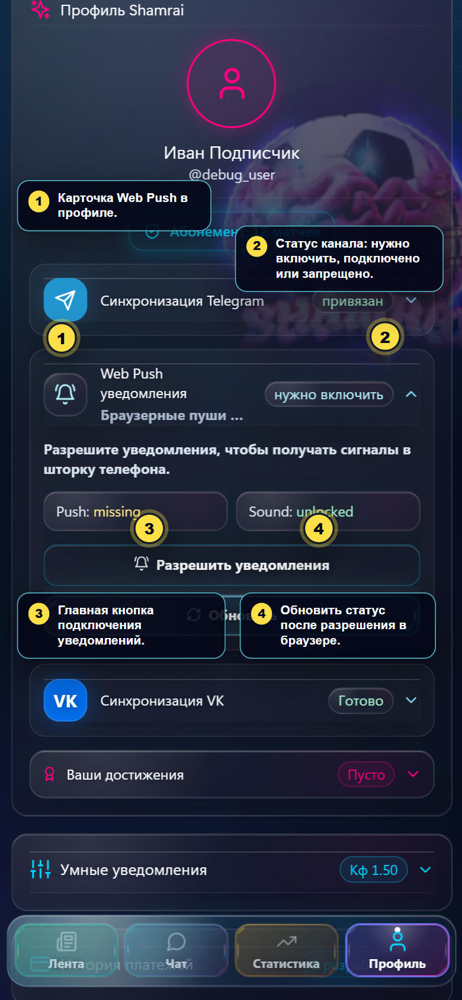
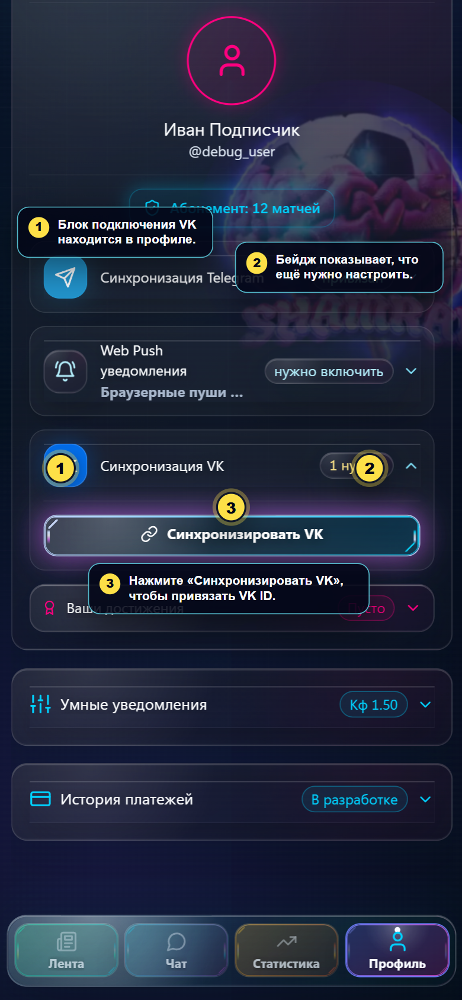
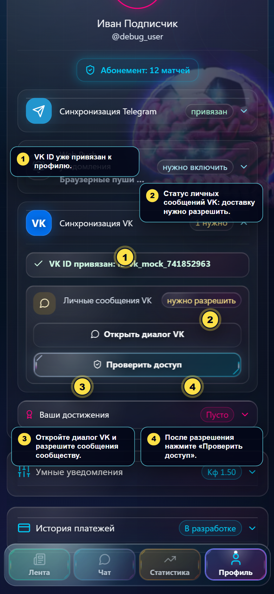
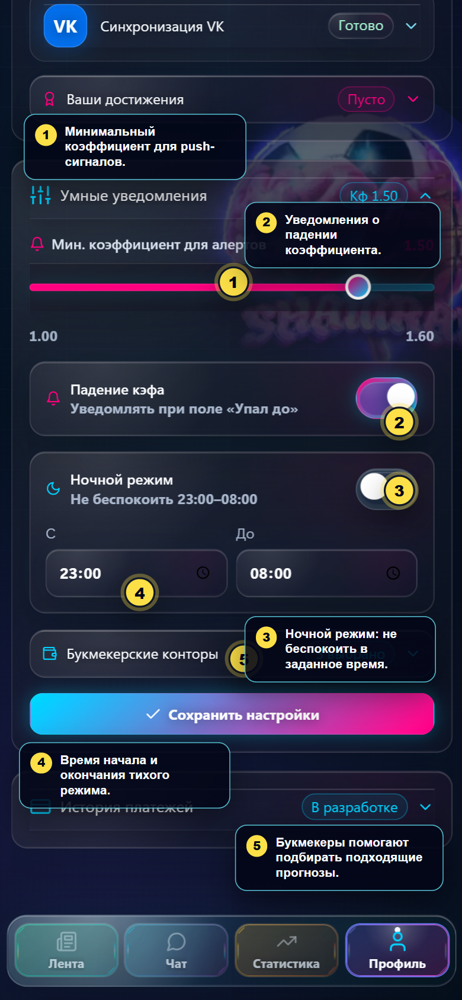

# Клиентское обучение Shamrai

Материал только для клиентского интерфейса. Админские разделы, внутренние настройки и технические интеграции здесь не описаны.

Открываемая HTML-версия: [index.html](index.html).

## Быстрый маршрут клиента

1. **Лента** - смотреть доступные прогнозы, коэффициенты и открывать матч.
2. **Чат** - получать web-сигналы и писать в поддержку.
3. **Анонс ставки** - нажать **Взять**, если клиент хочет получить полный прогноз.
4. **Статистика** - проверять личные результаты и общую статистику Shamrai.
5. **Профиль** - подключать Telegram, VK, Web Push, настраивать уведомления и смотреть статус абонемента.

## Лента прогнозов



Что важно:

- Карточка прогноза показывает вид спорта, статус события, матч и букмекера.
- **Коэффициент** - значение, по которому опубликован прогноз.
- **Открыть матч** - переход к подробностям и доступному действию по прогнозу.
- Нижнее меню переключает основные разделы: лента, чат, статистика, профиль.

## Чат и web-сигналы



Что важно:

- Вверху видно, что работает **Web канал** и личный бот.
- Внутри чата есть зоны сигналов и поддержки.
- Если сигнал пришёл вне Telegram, он дублируется в этом разделе.
- Для вопроса менеджеру клиент остаётся во вкладке **Чат**.

## Как взять ставку после анонса



Типовой путь:

1. Клиент получает анонс через Telegram, VK, Web Push или web-чат.
2. Открывает Shamrai и переходит в **Чат** -> **Личный бот**.
3. Читает анонс: матч, коэффициент, доступные БК и краткое описание.
4. Если хочет получить полный прогноз, нажимает **Взять**.
5. Если прогноз не подходит, нажимает **Не взять**.
6. После **Взять** заявка уходит Shamrai. Дальше полный прогноз приходит в подключённый канал: Telegram, VK или web-чат.
7. Оформленный прогноз и рассчитанные результаты потом попадают в **Статистика**.

Важно: обычная открытая публикация в **Ленте** может не иметь кнопки **Взять**. Кнопка появляется именно у персональных анонсов, где клиент выбирает, нужен ли ему полный прогноз.

## Статистика



Основные значения:

- **Моя статистика** - результаты прогнозов, которые взял клиент.
- **Статистика Shamrai** - общая статистика платформы.
- **Фл.** - флэт, условная единица ставки; показатель удобен для сравнения дистанции.
- **ROI** - эффективность ставок в процентах.
- **Проход** - доля выигранных прогнозов.
- **Средний КФ** - средний коэффициент по выбранному периоду.
- Фильтр периода меняет расчёт: неделя, месяц, квартал или всё время.

## Подключение Web Push



Как подключить:

1. Открыть **Профиль**.
2. Раскрыть карточку **Web Push уведомления**.
3. Нажать **Разрешить уведомления**.
4. Когда браузер или телефон спросит разрешение, выбрать **Разрешить**.
5. После этого нажать **Обновить** или проверить статус карточки.

Если статус показывает **запрещено**, уведомления отключены в настройках браузера или телефона. Нужно разрешить уведомления для Shamrai в системных настройках и затем вернуться в профиль.

## Иконка Shamrai на главном экране телефона

После подключения Web Push лучше вынести Shamrai на рабочий стол телефона. Так клиент открывает сайт с иконки как обычное приложение и быстрее видит анонсы.

### Android

1. Открыть **https://shamra1.pro/** в Chrome или основном браузере телефона.
2. Нажать меню **⋮** справа от адресной строки.
3. Выбрать **Установить приложение** или **Добавить на главный экран**.
4. Оставить название **Shamrai** и нажать **Добавить**.
5. После этого запускать Shamrai с новой иконки на рабочем столе.

### iPhone

1. Открыть **https://shamra1.pro/** именно в Safari.
2. Нажать кнопку **Поделиться**. Если внизу видна кнопка **…**, сначала нажать её, затем **Поделиться**.
3. Прокрутить список и выбрать **На экран «Домой»**.
4. Проверить название **Shamrai** и нажать **Добавить**.
5. Дальше открывать Shamrai с иконки на домашнем экране.

На iPhone web-уведомления обычно работают для web-приложения после добавления на экран «Домой» и запуска Shamrai с этой иконки.

## Подключение VK ID



Как подключить VK:

1. Открыть **Профиль**.
2. Раскрыть карточку **Синхронизация VK**.
3. Нажать **Синхронизировать VK**.
4. Подтвердить вход через VK ID.
5. Вернуться в Shamrai и проверить, что VK ID привязан.

## Разрешение сообщений VK



После привязки VK ID может остаться статус **1 нужно**. Обычно это означает, что сообщения от сообщества ещё не разрешены.

Что сделать:

1. В профиле открыть **Синхронизация VK**.
2. Нажать **Открыть диалог VK**.
3. Разрешить сообщения от сообщества VK.
4. Вернуться в Shamrai и нажать **Проверить доступ**.
5. Когда доступ подтверждён, бейдж VK должен стать **Готово**.

## Настройки уведомлений



Что можно настроить:

- **Мин. коэффициент для алертов** - ниже этого значения push-сигналы не будут беспокоить клиента.
- **Падение кэфа** - уведомления, когда коэффициент просел до отмеченного значения.
- **Ночной режим** - период, когда Shamrai не должен беспокоить push-уведомлениями.
- **Букмекерские конторы** - помогают подбирать прогнозы под счета клиента.
- После изменений нажать **Сохранить настройки**.

## Короткий FAQ для клиента

**Где подключить VK?**  
Профиль -> Синхронизация VK -> Синхронизировать VK.

**Где включить web-уведомления?**  
Профиль -> Web Push уведомления -> Разрешить уведомления.

**Как вынести Shamrai на главный экран телефона?**  
Android: открыть **https://shamra1.pro/** в Chrome -> меню **⋮** -> **Установить приложение** или **Добавить на главный экран**. iPhone: открыть сайт в Safari -> **Поделиться** -> **На экран «Домой»** -> **Добавить**.

**Где смотреть статистику?**  
Вкладка **Статистика** в нижнем меню.

**Что делать, когда пришёл анонс ставки?**  
Открыть **Чат** -> **Личный бот** и нажать **Взять**, если нужен полный прогноз. Если прогноз не нужен, нажать **Не взять**.

**Что значит ROI?**  
Это процентная эффективность ставок за выбранный период.

**Что значит "Фл."?**  
Это флэт, условная единица ставки. Он показывает результат без привязки к конкретной сумме в рублях.

**Почему VK показывает "1 нужно"?**  
VK ID привязан, но сообщения от сообщества ещё не разрешены. Нужно открыть диалог VK, разрешить сообщения и нажать **Проверить доступ**.

## Обновление скриншотов

Для обновления скриншотов запустить локальный frontend в debug/mock-режиме, затем:

```powershell
node .\scripts\capture-client-training-screenshots.mjs
```

Скрипт сохраняет финальные изображения в `docs/client-training/assets/`.
