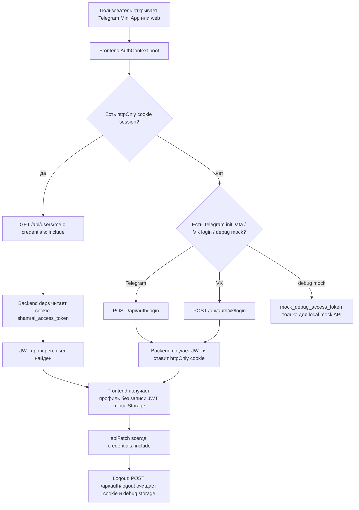
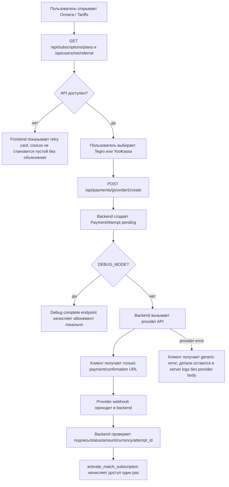
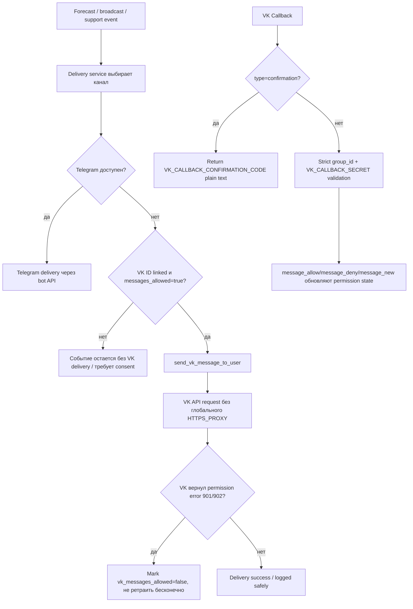
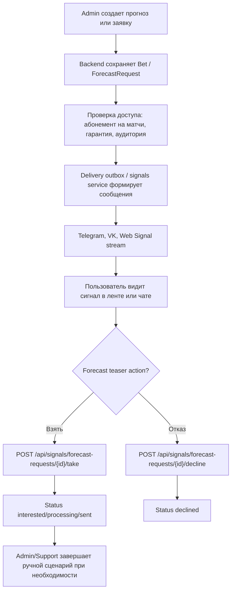
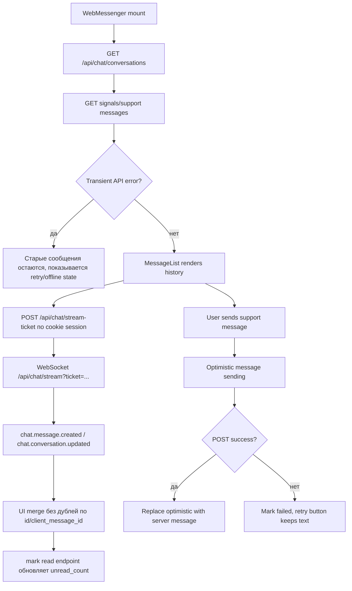
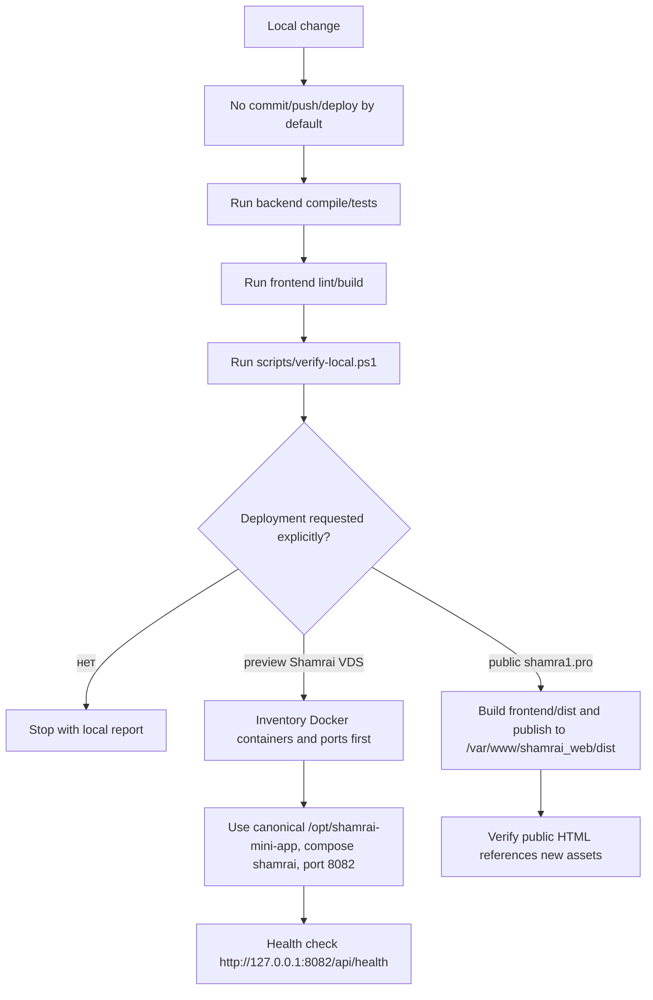

# Process Flows

Карта основных процессов Shamrai. Файл нужен для быстрого онбординга разработчика: где начинается сценарий, какие сервисы участвуют и где процесс завершается.

## Auth

## Payments

## VK And Telegram Delivery

## Forecast Lifecycle

## Chat

## Deploy And Verification

