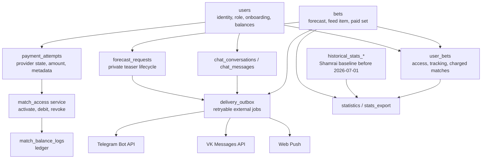
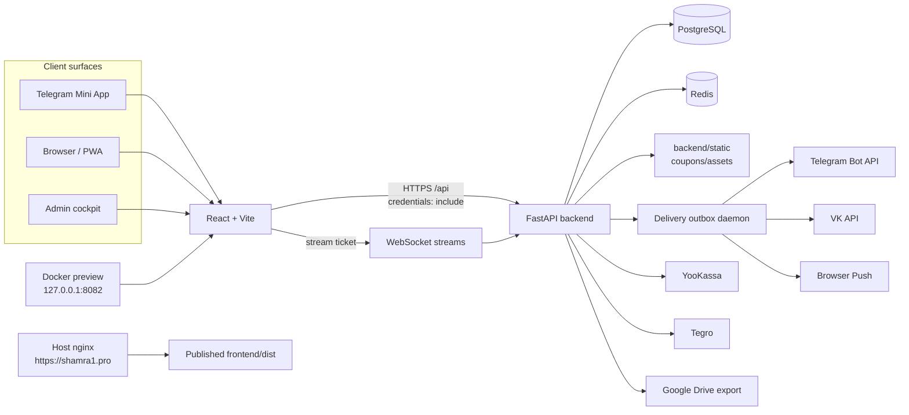
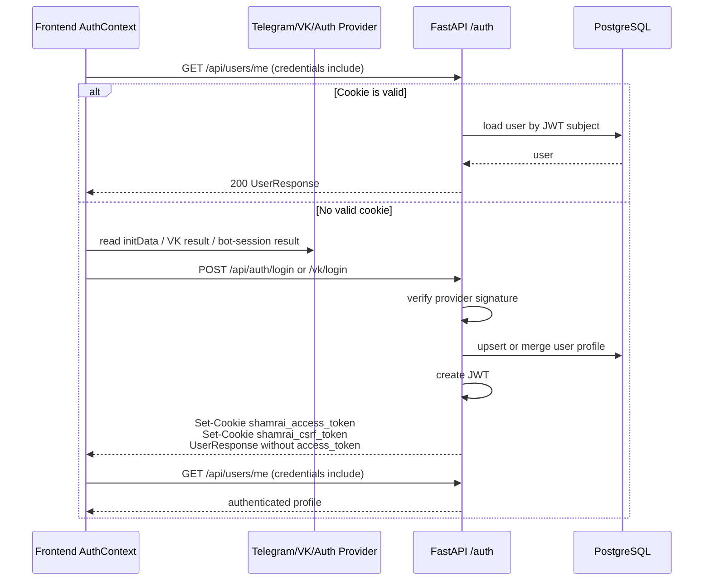
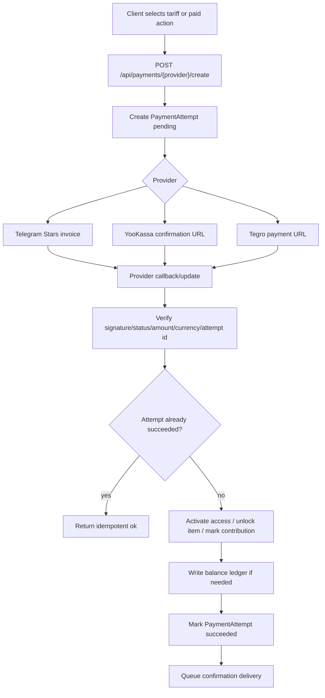
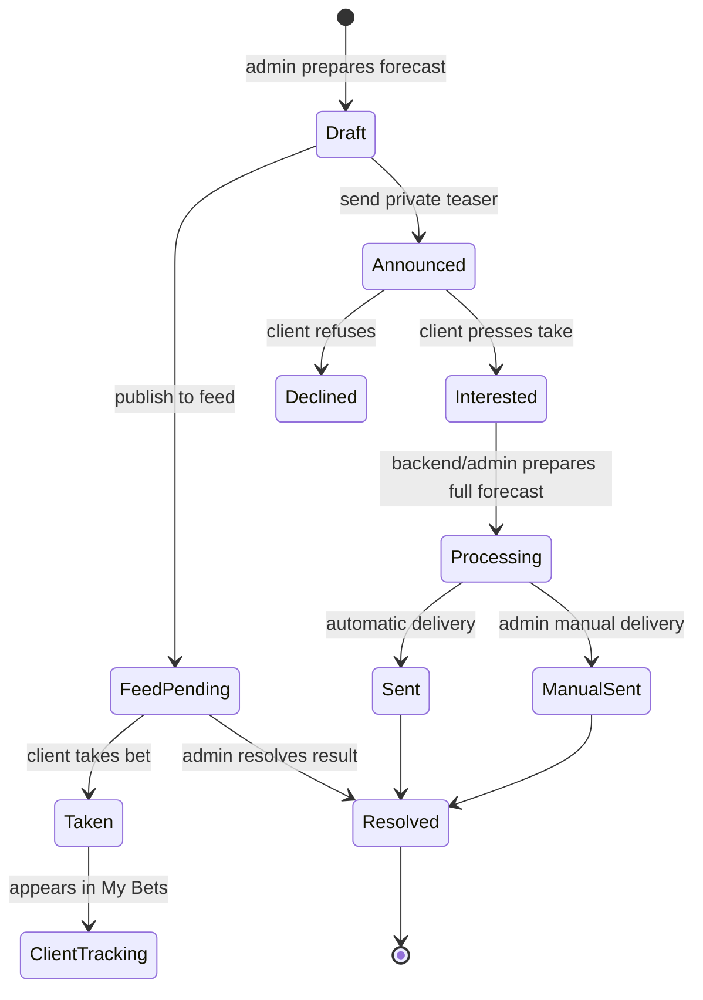
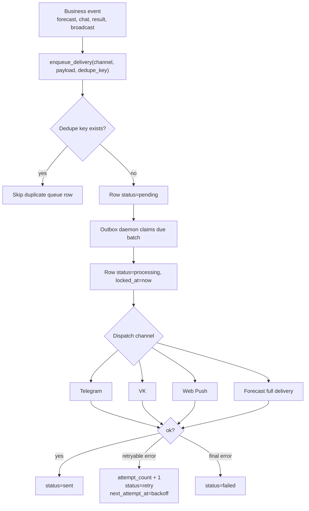
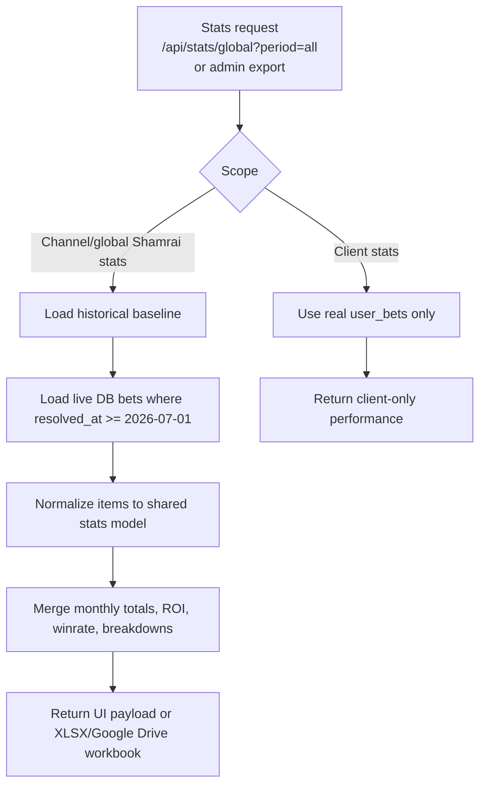
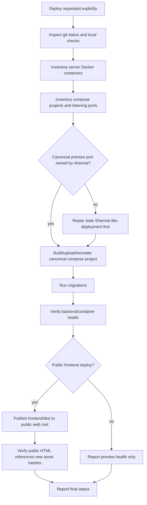

# Shamrai Project Overview

Дата ревизии: 2026-07-02.

Этот документ описывает проект человеческим языком: что делает Shamrai Mini App,
какие роли в нем есть, как проходят основные алгоритмы и какие технические
инварианты нельзя ломать. Для пошаговых сценариев см. также
[functional-algorithms.md](functional-algorithms.md), а для кратких процессных схем -
[process-flows.md](process-flows.md).

## 1. Короткое Описание

Shamrai Mini App - это full-stack система для спортивной аналитики и клиентского
сопровождения. Клиент открывает приложение в Telegram Mini App или браузере,
проходит авторизацию, выбирает букмекеров и получает доступ к прогнозам, чату,
платным тарифам, уведомлениям и статистике. Команда Shamrai работает через
админский кабинет: создает прогнозы, ведет клиентов, отвечает в чатах, запускает
рассылки, проверяет статистику и выгружает отчеты.

Проект объединяет четыре поверхности:

- клиентское приложение в Telegram Mini App;
- браузерную/PWA-версию для клиентов VK/Telegram;
- админский cockpit для команды;
- backend webhooks/API для Telegram, VK, платежей и экспортов.

Главная идея архитектуры: пользовательские действия, платежи, доступы, прогнозы и
доставка сигналов должны быть идемпотентными. Если внешний сервис прислал webhook
дважды, клиент нажал кнопку повторно или delivery daemon перезапустился, доступ не
должен выдаваться дважды, баланс не должен списываться дважды, а сообщение не должно
уходить бесконечно.

## 2. Роли И Поверхности

| Роль | Где работает | Что делает |
| --- | --- | --- |
| Клиент | Telegram Mini App, web/PWA | Проходит onboarding, покупает доступ, берет прогнозы, смотрит статистику, пишет в поддержку |
| VK/web-only клиент | web/PWA | Входит через VK ID, позже может привязать Telegram без потери баланса |
| Moderator | Admin cockpit | Работает с прогнозами, чатами и частью CRM |
| Admin | Admin cockpit | Управляет клиентами, прогнозами, рассылками, тарифами, статистикой |
| Owner | Admin cockpit | Имеет полный доступ, включая чувствительные роли и системные настройки |
| Внешний провайдер | Webhooks | Telegram, VK, YooKassa, Tegro и другие интеграции присылают события backend |

## 3. Доменная Карта

## 4. Runtime Architecture

## 5. Auth And Session Algorithm

В production приложение использует httpOnly cookie. JSON-ответ логина специально не
раскрывает bearer token. Это снижает XSS-риск и делает сессию управляемой backend-ом.
Для Telegram Web/VK embedded contexts cookie на HTTPS выставляются как
`SameSite=None; Secure`, иначе iframe/webview может принять успешный логин, но не
отправить cookie в следующий `/api/users/me`.

Auth invariants:

- production cookies are `HttpOnly`, scoped to `/api`, `Secure` on HTTPS;
- embedded HTTPS contexts use `SameSite=None`;
- local HTTP development keeps `SameSite=Lax`;
- bearer localStorage is only compatibility/debug surface, not primary production auth;
- CSRF applies to unsafe cookie-authenticated API methods except signed webhook/login paths.

## 6. Payment And Access Algorithm

Платеж никогда не выдает доступ прямо из frontend. Frontend получает только ссылку
на оплату или invoice. Источник правды - verified provider callback/update.

Access invariants:

- `PaymentAttempt.status=succeeded` is the safe source of truth;
- access activation must be idempotent;
- match balance changes must go through ledger services;
- duplicate webhooks must not duplicate balance, access or delivery;
- provider errors must not leak provider secrets or raw internals to clients.

## 7. Forecast Lifecycle Algorithm

Important rules:

- feed access and private forecast requests are related but separate workflows;
- `user_bets` records client access/tracking for concrete bets;
- private forecast request status must not be inferred only from `bets.status`;
- resolving a bet can trigger client result messages and compensation rules;
- hidden/paid forecast fields stay masked until verified access exists.

## 8. Delivery Outbox Algorithm

External delivery is intentionally asynchronous. Telegram, VK and Web Push can fail,
rate-limit or become temporarily unavailable. Outbox gives the app retryability and
clear final statuses.

Delivery invariants:

- use stable dedupe keys for repeated events;
- never log tokens, raw provider secrets or private message payloads unnecessarily;
- VK permission errors 901/902 mark messages as denied and should not retry forever;
- WebSocket streams use short-lived tickets instead of long-lived JWT in URLs.

## 9. Historical And Live Statistics Algorithm

Shamrai all-time channel statistics combine two sources:

- historical Excel baseline before `2026-07-01`;
- live database bets from `2026-07-01` onward.

This prevents two bad outcomes: losing pre-July history or double-counting old live rows.

Stats invariants:

- Excel baseline is channel-level, not client-level;
- pre-July source of truth is the imported workbook baseline;
- all-time channel stats must not count pre-July live DB bets twice;
- detailed live rows remain real DB bets;
- historical June workbook rows can be shown separately because exact day-level dates
  are not fully reliable.

## 10. Deployment Guard Algorithm

Shamrai has one canonical VDS preview deployment and one public frontend surface.
Deployment must not create alternative ports or projects to avoid conflicts.

Deployment invariants:

- do not create a second Shamrai app directory, compose project or preview port;
- do not stop unrelated containers, databases, nginx or ports `80/443` unless explicitly asked;
- public `https://shamra1.pro/` is served by host nginx from a static web root, not by
  the Docker preview frontend directly;
- health must be checked on the correct surface after deploy;
- secrets must stay in runtime env or ignored local files, never in docs or commits.

## 11. Operational Checklist

Before a production-facing change:

1. Inspect `git status --short --branch`.
2. Run focused tests near the change.
3. Run backend compile/import/Alembic/test gates when backend changes.
4. Run frontend lint/test/build when frontend changes.
5. Run dependency audits before release-like work.
6. Inspect `git diff --check` and staged diff before commit.
7. Deploy only after explicit user request.
8. Verify public/preview health after deploy.
9. Keep test data out of production databases.
10. Keep secret files ignored and never print secret values in chat/logs.

## 12. Quick Reading Order

For a new developer:

1. `README.md`
2. `docs/project-overview.md`
3. `docs/process-flows.md`
4. `docs/functional-algorithms.md`
5. `backend/src/models/models.py`
6. `backend/src/api/auth.py`
7. `backend/src/api/deps.py`
8. `backend/src/api/payments.py`
9. `backend/src/services/delivery_outbox.py`
10. `frontend/src/context/AuthContext.tsx`
11. `frontend/src/App.tsx`
